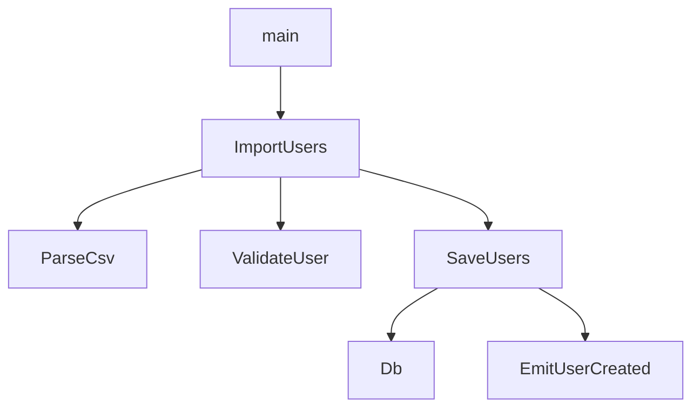
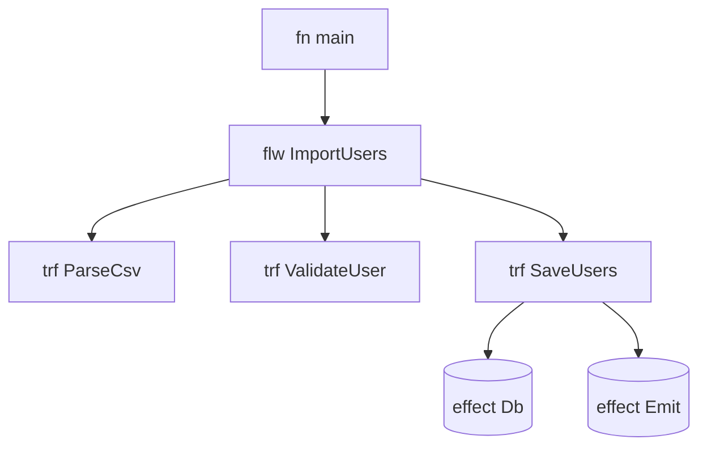

# Favnir Graph Explain

日付: 2026-04-30

## 目的

`main` から到達可能な `fn / trf / flw / rune / effect` を解析して、

- 構造を説明する
- 依存関係を可視化する
- Mermaid 形式で保存する

ための仕組みを定義する。

Forge にも依存関係可視化の発想はあったが、Favnir では

- `explain`
- `artifact`
- `exec --info`
- `Veltra`

と一体化させる。

---

## なぜ重要か

Favnir は「コードを書く言語」だけでなく、

- `trf`
- `flw`
- effect
- artifact
- explain

を静的に読めるのが強みである。

そのため、依存関係可視化は単なる図示ではなく、

- explain の別表現
- review 用の情報
- Veltra notebook の graph pane
- AI 向け metadata

として価値を持つ。

---

## 機能の位置づけ

### `fav explain`

- 型
- effect
- deps
- artifact info

を読むコマンド

### `fav graph`

- 依存構造を図として出すコマンド

### `fav bundle`

- 実際に含まれる単位を確定するコマンド

関係としては:

- `bundle` が対象を決める
- `explain` が意味を出す
- `graph` が構造を可視化する

---

## 基本モデル

グラフノード候補:

- `fn`
- `trf`
- `flw`
- `rune`
- builtin
- effect

グラフエッジ候補:

- calls
- composes
- uses builtin
- emits effect
- contained in rune

最初は最小限でよい。

### MVP ノード

- `fn`
- `trf`
- `flw`
- effect

### MVP エッジ

- `fn -> fn`
- `fn -> flw`
- `flw -> trf`
- `trf -> effect`

---

## 到達可能性

基本は `main` 起点。

### entry

- デフォルトは `main`
- 将来 `--entry <name>` を受ける

### reachability

- `main` から辿れるものだけを出す
- 到達不能な `trf/flw/fn` は出さない

これにより、プロジェクト全体ではなく
「いま実際に実行される構造」を見せられる。

---

## CLI 案

### 最小

```text
fav graph src/main.fav
```

### 出力形式指定

```text
fav graph src/main.fav --format mermaid
fav graph src/main.fav --format json
```

### 出力ファイル

```text
fav graph src/main.fav --format mermaid --out graph.mmd
```

### entry 指定

```text
fav graph src/main.fav --entry main
```

### 粒度指定

```text
fav graph src/main.fav --focus flw
fav graph src/main.fav --focus trf
fav graph src/main.fav --focus all
```

### effect 表示

```text
fav graph src/main.fav --show-effects
```

---

## Mermaid 出力

### 最小例



### node 種別付き



---

## JSON 出力

Veltra や AI が扱いやすいように、内部表現に近い JSON も持つ。

```json
{
  "entry": "main",
  "nodes": [
    { "id": "main", "kind": "fn", "label": "main" },
    { "id": "ImportUsers", "kind": "flw", "label": "ImportUsers" },
    { "id": "ParseCsv", "kind": "trf", "label": "ParseCsv" },
    { "id": "Db", "kind": "effect", "label": "Db" }
  ],
  "edges": [
    { "from": "main", "to": "ImportUsers", "kind": "calls" },
    { "from": "ImportUsers", "to": "ParseCsv", "kind": "composes" },
    { "from": "SaveUsers", "to": "Db", "kind": "effect" }
  ]
}
```

---

## 粒度

### `--focus all`

- `fn`
- `trf`
- `flw`
- effect

### `--focus flw`

- `flw`
- それを構成する `trf`

### `--focus trf`

- `trf`
- builtin
- effect

### `--focus fn`

- `fn` の call graph

最初は `all / flw / trf` の 3 つで十分。

---

## effect ノード

effect を図に出すのは Favnir の差別化になる。

例:

- `Db`
- `Io`
- `Network`
- `Trace`
- `Emit<UserCreated>`

これは普通の call graph より一段価値がある。

---

## bundle との関係

将来的には、

- `fav bundle`
- `fav graph`

をつなげる。

例:

```text
fav bundle src/main.fav --entry main
fav graph src/main.fav --entry main --bundled
```

ここで graph は、実際に bundle に含まれる単位を可視化する。

---

## artifact との関係

`.fvc` / `.wasm` でも graph を見られると強い。

将来案:

```text
fav graph dist/app.fvc
fav graph dist/app.fvc --format mermaid
```

artifact の metadata が十分なら、

- entry
- functions
- effects
- reachability

から graph を再構成できる。

---

## Veltra との関係

Veltra ではこれを graph pane にする。

### Veltra graph pane

- notebook セル単位の graph
- current entry の graph
- effect highlighted
- `flw` ごとの collapse / expand

つまり CLI の `fav graph` は、
そのまま Veltra UI の backend になる。

---

## 差別化

他言語の一般的な call graph と違って、Favnir では:

- `trf / flw`
- effect
- artifact
- explain

を同じグラフ上で扱える。

これが唯一無二に近い。

---

## MVP

最初にやるべき最小版:

1. source から `main` 起点の reachability を取る
2. `fn / trf / flw / effect` をノード化する
3. Mermaid へ出す
4. `--out` で保存する

これだけで十分価値がある。

---

## Post-MVP

- JSON graph export
- artifact graph
- `rune` 単位 graph
- graph diff
- CI integration
- Veltra graph pane
- AI 向け graph metadata

---

## 一言でいうと

`fav graph` は、

> explain を図にしたもの

である。

そして Favnir では、

> `main` から到達可能な `trf / flw / effect` を Mermaind/JSON で可視化できる

ところまでやるとかなり強い。
