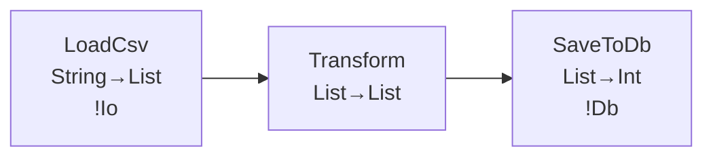

# Favnir Master Roadmap — v20.1 〜 v25.0

Date: 2026-06-18
Status: 計画中（v20.0.0 完了時点）

---

## 背景と方針

v20.0.0「Production Performance」の宣言をもって、Favnir は以下を達成した:

```
v17.0 — Language Ergonomics   : 書きたくなる  ✓
v18.0 — Language Power        : 表現できる    ✓
v19.0 — Type System Maturity  : 信頼できる    ✓
v20.0 — Production Performance: 本番で速い    ✓
```

次の 5 マイルストーンは「**本番で速い**」をさらに深化させ、
「**スケールアウトできる**」「**完全に自律した言語**」を目指す。

```
v21.0 — Runtime Excellence    : 「VM が限界まで速い」
v22.0 — Developer Tooling     : 「開発体験が最高」
v23.0 — Distributed Scale     : 「スケールアウトできる」
v24.0 — VM in Favnir          : 「Favnir が Favnir を動かす」
v25.0 — Practical Self-Hosting : 「自己記述として完成」
```

### 測らずに最適化しない原則

v21 シリーズからすべての最適化作業は以下のサイクルで進める:

```
1. Measure   — 事前計測でベースラインを確定
2. Optimize  — 最適化を実装
3. Verify    — 事後計測で改善量を検証
4. Document  — benchmarks/<version>.json に結果を記録（CI が自動生成）
```

**ベンチマーク正本の役割分担:**

| ファイル | 役割 | 生成者 |
|---|---|---|
| `benchmarks/<version>.json` | 機械可読な正本（比較・CI に使う） | CI が自動生成 |
| `benchmarks/results.md` | 人間可読な説明資料（正本から生成） | `benchmarks/compare.fav --emit-md` が更新 |

`results.md` を手書きで更新しない。CI が JSON を生成し、そこから `results.md` を上書きする。
この分離により「JSON と results.md が食い違う」状態が構造的に起こらない。

最初の一手は必ず **ベンチマーク基盤の整備**（v20.1）である。
「改善できた」という主観ではなく、数字で語ることを文化として定着させる。

---

## v21.0 — Runtime Excellence

**テーマ**: 「VM が限界まで速い」
**期間**: v20.1〜v20.8 → v21.0 マイルストーン宣言

### なぜ Production Performance の次か

v20.0 で「速い」を実現したが、その速さの上限はまだ見えていない。
DuckDB プッシュダウン・NaN-boxing・io_uring——
これらは「試してみたら速くなった」ではなく「なぜ速くなるかを理解した上で実装する」。
そのためにまずベースラインを計測し、**数字を持った判断**から始める。

### 対象ユーザーへの価値

- 「Favnir で書いたパイプラインが Python / Spark より速い」という実績
- 大規模 ETL（1TB+）を Favnir 単体で完結できる
- Lambda / Fargate の課金が下がる（実行時間削減）

### 成功基準（項目別 SLO）

v21.0 は「全て2x改善」ではなく、以下の項目別目標で達成を判定する。
（cold_start はすでに 18ms と低く、絶対値での改善が重要）

| ベンチマーク | v20.0.0 基準 | v21.0 目標 | 根拠 |
|---|---|---|---|
| cold_start_precompiled | 18ms | **< 10ms** | NaN-boxing + 起動パス最適化 |
| csv_10gb_throughput | ~340 MB/s | **> 1 GB/s (3x)** | mmap + SIMD CSV パーサー |
| tight_loop_10m_iter | ~85ms | **< 30ms (2.8x)** | スーパー命令 |
| record_transform_1m | ~210ms | **< 80ms (2.6x)** | NaN-boxing |
| duckdb_query（集計） | VM 実行 | **DuckDB 委譲（10〜100x）** | pushdown |

---

### v20.1 — ベンチマーク基盤整備（Benchmark Infrastructure）

最初の一手。**何も最適化しない**。計測だけを整える。

#### なぜ最初か

ベンチマークなしに最適化すると:
- 「速くなった気がする」という印象で終わる
- リグレッションを検知できない
- どの施策が効いたかわからない

#### 計測対象（ベンチマークスイート）

```
benchmarks/suite/
├── 01_cold_start.sh          # Lambda コールドスタート（--precompiled あり/なし）
├── 02_csv_10gb.fav           # 10GB CSV ストリーミング（スループット / ピークメモリ）
├── 03_tight_loop.fav         # 整数演算タイトループ（純粋 VM 速度）
├── 04_record_transform.fav   # レコード変換 100万行（アロケーション速度）
├── 05_compile_time.sh        # コンパイル時間（cold / incremental）
├── 06_duckdb_query.fav       # DuckDB クエリ（比較用）
├── 07_arrow_parquet.fav      # Arrow → Parquet 書き込み（I/O スループット）
└── 08_concurrent_stages.fav  # par [A, B] 並列 stage（スレッド効率）
```

#### CI 統合

```yaml
# .github/workflows/bench.yml
# master push ごとに実行し、前回比 10% 以上の劣化で warning
- name: Run benchmarks
  run: bash benchmarks/suite/run_all.sh --format json > benchmarks/latest.json

- name: Compare with baseline
  run: |
    fav run benchmarks/compare.fav \
      --baseline benchmarks/v20.0.0.json \
      --current  benchmarks/latest.json \
      --threshold 10
```

#### v20.0.0 ベースライン確定

実装完了後、CI で計測した結果を `benchmarks/v20.0.0.json` として保存し、
以後のすべてのバージョンの比較基準とする。

```
v20.0.0 ベースライン（参考値 / 実測後に更新）:
  cold_start_full:         ~320ms
  cold_start_precompiled:   ~18ms
  csv_10gb_throughput:     ~340 MB/s
  tight_loop_10m_iter:      ~85ms
  record_transform_1m:     ~210ms
  compile_cold:            ~2.4s
  compile_incremental:     ~0.18s
  arrow_parquet_write_1gb: ~3.2s
```

#### 完了成果物（v20.1 の定義）

v20.1 は「計測基盤を作る」バージョンである。
以下のファイルが存在し CI が通ること = v20.1 完了。

| 成果物 | 目的 |
|---|---|
| `.github/workflows/bench.yml` | master push ごとに benchmarks/suite/ を実行 |
| `benchmarks/suite/run_all.sh` | 全スイートを JSON 形式で出力するラッパー |
| `benchmarks/suite/01_cold_start.sh` 〜 `08_concurrent_stages.fav` | 8 計測スクリプト |
| `benchmarks/compare.fav` | ベースライン比較スクリプト（劣化検知） |
| `benchmarks/v20.0.0.json` | v20.0.0 実測ベースライン（CI で生成・コミット） |

> `benchmarks/compare.fav` は Favnir で書かれた比較ツールであり、`--baseline` と `--current` の
> 2 つの JSON を受け取り、閾値超えの項目を列挙する。CI では終了コード 1 を返すことで fail を表現する。

---

### v20.2 — スーパー命令（Superinstruction）

最もコストが低く、即効性がある VM 最適化。

#### 仕組み

```
現状（3 回ディスパッチ）:
  LoadLocal(0) → Add → StoreLocal(1)

スーパー命令（1 回ディスパッチ）:
  AddLocalLocal(0, 1)   // "src0 + src1 を src0 に格納"
```

#### 実装方針

- 実測ホットパスを分析（v20.1 のベンチマーク結果を使う）
- 頻出する opcode ペアを top-N でリストアップ
- 上位 10〜20 パターンをスーパー命令に融合

#### 期待改善（v20.0.0 比）

- `tight_loop_10m_iter`: **+20〜30%**（ディスパッチ削減）
- `record_transform_1m`: **+10〜15%**（フィールドアクセスパターン改善）

---

### v20.3 — NaN-boxing（VMValue の圧縮）

VM の根幹。慎重に実施するが、インパクトは大きい。

#### 現状の問題

```rust
// 現状: enum は最大バリアントのサイズを全バリアントに適用
enum VMValue {
    Int(i64),      // 8 + 8 bytes（タグ + パディング）
    Float(f64),    // 8 + 8 bytes
    Bool(bool),    // 8 + 8 bytes
    Str(String),   // 8 + 24 bytes（String は 24 bytes）
    // ...
}
// → Vec<VMValue> は各要素が 32〜40 bytes、キャッシュミス多発
```

#### NaN-boxing 後

```
IEEE 754 の NaN には 2^52 個の "quiet NaN" パターンがある。
これらを使って型タグ + ポインタを 8 bytes に詰める。

[0x7FF8_0000_0000_0000] → NaN（Float）
[0x7FFx_xxxx_xxxx_xxxx] → タグ付きポインタ（Str/List/Record）
[0xFFF0_0000_xxxx_xxxx] → Int（32bit 範囲内）
[0xFFF1_0000_0000_000x] → Bool / Null
```

#### 期待改善（v20.0.0 比）

- `tight_loop_10m_iter`: **+2〜3x**（キャッシュヒット率大幅改善）
- `record_transform_1m`: **+1.5〜2x**

#### リスク管理

- 既存テスト（全件）がすべて通ることを移行の完了条件とする
- `--legacy-value-repr` フラグで旧表現にフォールバック可能にする

---

### v20.4 — DuckDB プッシュダウン最適化パス

Favnir 固有の最大の武器。`fav explain --lineage` の静的解析を活用。

#### コンセプト

```favnir
// 現状: Favnir VM でフィルタ・集計を実行
stage Filter: List<Row> -> List<Row> = |rows| {
  List.filter(rows, |r| r.amount > 1000.0 && r.status == "active")
}
stage Aggregate: List<Row> -> List<Summary> = |rows| {
  List.group_by(rows, |r| r.category)
  |> Map.map(|k, v| Summary { category: k, total: List.sum_by(v, |r| r.amount) })
}
seq Report = LoadFromDb |> Filter |> Aggregate
```

↓ 最適化パスが検出してDuckDB SQL に変換

```sql
-- Favnir コンパイラが自動生成
SELECT category, SUM(amount) as total
FROM rows
WHERE amount > 1000.0 AND status = 'active'
GROUP BY category
```

#### 変換可能なパターン（フェーズ1）

| Favnir 操作 | SQL 変換 |
|---|---|
| `List.filter(rows, \|r\| r.field > n)` | `WHERE field > n` |
| `List.group_by(rows, \|r\| r.key)` | `GROUP BY key` |
| `List.sum_by(rows, \|r\| r.val)` | `SUM(val)` |
| `List.map(rows, \|r\| r.field)` | `SELECT field` |
| `List.length(rows)` | `COUNT(*)` |

#### 期待改善（v20.0.0 比）

- `duckdb_query` ベンチマーク: **+10〜100x**（集計クエリの場合）
- DuckDB はベクトル実行エンジン、SIMD 対応済み

---

### v20.5 — mmap + SIMD CSV パーサー

I/O 層の根本的な改善。v19.5 の Arrow 基盤と組み合わせる。

#### 現状の問題

```
現状:
  File → read() syscall → バイト列コピー → csv クレート（行単位パース）
  → Vec<String> アロケーション × N行 → VMValue 変換

最適化後:
  File → mmap（ゼロコピーマッピング） → arrow-csv（SIMD パース）
  → Arrow RecordBatch（列指向メモリ） → VM へ直接渡す
```

#### 実装

```rust
// memmap2 + arrow-csv の組み合わせ
use memmap2::MmapOptions;
use arrow_csv::ReaderBuilder;

fn read_csv_mmap(path: &str) -> Result<RecordBatch, ...> {
    let file = File::open(path)?;
    let mmap = unsafe { MmapOptions::new().map(&file)? };
    // SIMD 対応パーサーで直接 Arrow RecordBatch に
    let reader = ReaderBuilder::new(schema).build(Cursor::new(&mmap[..]))?;
    reader.next().transpose()?
}
```

#### 期待改善（v20.0.0 比）

- `csv_10gb_throughput`: **+3〜5x**（syscall 削減 + SIMD 解析）
- ピークメモリ: **-40%**（ゼロコピー）

---

### v20.6 — io_uring 非同期 I/O（Linux）

Linux 5.1+ 限定だが、本番サーバー環境では最大の I/O 改善。

#### 現状（epoll ベース）vs io_uring

```
epoll:     read() syscall → kernel copy → user buffer
           1ファイル = 2回のコンテキストスイッチ

io_uring:  ring buffer への submit → 完了通知
           1000ファイル = ほぼ 0 回のコンテキストスイッチ
```

#### 実装方針

```toml
# Cargo.toml（Linux のみ）
[target.'cfg(target_os = "linux")'.dependencies]
tokio-uring = "0.4"
```

```rust
#[cfg(target_os = "linux")]
async fn read_csv_uring(path: &str) -> Result<Vec<u8>, ...> {
    tokio_uring::fs::File::open(path).await?
        .read_to_end(vec![]).await
}
```

#### 期待改善（Linux 本番環境）

- 大量ファイル読み込みパイプライン: **+2〜4x**
- DB + ファイル I/O 混在パイプライン: **+1.5〜2x**
- Windows / macOS では自動で epoll / kqueue にフォールバック

---

### v20.7 — Arena アロケータ（GC なし高速アロケーション）

パイプライン実行中のアロケーションをバッチ化して解放コストをゼロにする。

#### コンセプト

```
現状: VM が stage 実行のたびに Vec<VMValue> を個別アロケート・解放
      → malloc/free のオーバーヘッド

Arena: stage の実行単位（1 chunk = 1000 行）にアリーナを割り当て
      → chunk 処理完了時に一括解放（free が 1 回）
```

#### 期待改善

- `record_transform_1m`: **+20〜40%**（アロケーションコスト削減）
- ストリーミングパイプラインの定常メモリ: **-20%**

---

### v20.8 — DB コネクションプール統合

データベースを使うパイプラインで「接続確立コスト」を排除する。

#### 現状の問題

```favnir
// 現状: stage ごとに接続を確立・解放
stage LoadUsers: Unit -> List<User> = |_| {
  bind conn <- Postgres.connect()  // ←毎回 ~50ms の接続確立
  Postgres.query(conn, "SELECT * FROM users")
}
```

#### 改善後

```favnir
// コネクションプールを pipeline レベルで共有
seq UserPipeline
  [pool: Postgres.Pool]  // pool 宣言
= LoadUsers(pool) |> Transform |> Save(pool)

// fav.toml で設定
[postgres]
pool_size = 10
min_idle = 2
```

#### 期待改善

- DB を使う stage の初回実行: **-50ms〜**（接続確立コスト削減）
- 複数 stage が DB を使うパイプライン: **+2〜3x**（接続再利用）

---

### v21.0 — Runtime Excellence マイルストーン宣言

**完了条件:**

| ベンチマーク | v20.0.0 ベースライン | v21.0 目標 | 達成方法 |
|---|---|---|---|
| cold_start_precompiled | 18ms | **< 10ms** | NaN-boxing + 起動最適化 |
| csv_10gb_throughput | ~340 MB/s | **> 1 GB/s** | mmap + SIMD |
| tight_loop_10m_iter | ~85ms | **< 30ms** | スーパー命令 |
| record_transform_1m | ~210ms | **< 80ms** | NaN-boxing |
| duckdb_query（集計） | VM 実行 | **DuckDB 委譲（10〜100x）** | pushdown |

> 注: cold_start は絶対値での改善（-8ms）が目標。割合（1.8x）が他項目より低いのは設計上の意図による。

---

---

## v22.0 — Developer Tooling Complete

**テーマ**: 「開発体験が最高」
**期間**: v21.1〜v21.8 → v22.0 マイルストーン宣言

### なぜ Runtime Excellence の次か

言語が速くなった後、次の摩擦点は「**デバッグできない**」「**カバレッジが見えない**」
「**リファクタリングが怖い**」という開発体験の問題である。
LSP の基礎は v9.11.0 で作ったが、プロフェッショナルな開発環境としてはまだ不完全。
「VS Code で Favnir を書くなら Python より快適」を目指す。

### 対象ユーザーへの価値

- IDE でブレークポイントを置いてパイプラインを 1 ステップずつ実行できる
- テストカバレッジが数字で見える
- 大規模リファクタリングを型システムに支えてもらえる
- パイプラインの構造を図として共有できる

---

### v21.1 — DAP デバッガー（Debug Adapter Protocol）

VS Code / Neovim から Favnir パイプラインをステップ実行できる。

#### 機能

```
- ブレークポイント設定（stage の入口・出口）
- 変数インスペクション（現在の binding の型と値を表示）
- ステップ実行（stage 単位 / 式単位）
- 条件付きブレークポイント（`|r| r.amount > 1000.0` が true の行だけ止める）
- ウォッチ式（binding の変化を監視）
```

#### 実装

```
fav dap                 # DAP サーバーを起動（ポート 5678）
fav run --debug         # デバッグモードで実行（DAP 接続待機）
```

DAP プロトコル（JSON-RPC）は VS Code / Neovim / Emacs DAP モードと互換。

---

### v21.2 — `fav explain` 可視化強化

現状の `fav explain --lineage` はテキスト出力のみ。
視覚的なパイプライン図として出力できるようにする。

#### 新出力形式

```bash
# Mermaid 形式（GitHub / Notion / Obsidian で直接レンダリング）
fav explain --lineage --format mermaid src/pipeline.fav
# → pipeline.mmd

# D2 形式（インタラクティブ SVG）
fav explain --lineage --format d2 src/pipeline.fav
# → pipeline.d2

# JSON（外部ツール連携）
fav explain --lineage --format json src/pipeline.fav
```

#### Mermaid 出力例



---

### v21.3 — テストカバレッジ（`fav test --coverage`）

どのパイプライン経路がテストされているか可視化する。

#### 出力形式

```bash
fav test --coverage src/
# → coverage/index.html（HTML レポート）
# → coverage/lcov.info（CI 連携用）

# サマリー表示
Coverage: 78.4% (234/298 lines)
  ✓ pipeline.fav      95.2%  (40/42)
  ✓ transform.fav     88.1%  (59/67)
  ✗ loader.fav        51.3%  (81/158)  ← 要改善
```

#### 計装方針

- stage の入口・出口に計装コードを挿入（`--coverage` フラグ時のみ）
- 行カバレッジ + branch カバレッジ（match の各 arm）
- `--coverage` なし実行では計装コードがゼロコスト

---

### v21.4 — `fav lint` 強化（W006〜W015）

v17.0 で W001〜W005 を実装した。より実践的なルールを追加する。

| ルール | 内容 |
|---|---|
| W006 | 巨大な stage（100 行超）— 分割を推奨 |
| W007 | エフェクトなし stage が外部 I/O を呼んでいる |
| W008 | 未使用の type 定義 |
| W009 | `List.map` + `List.filter` の連鎖 → `List.filter_map` を推奨 |
| W010 | `bind x <- Result.ok(expr)` — `Result.ok` が不要 |
| W011 | 同一 binding への再代入（E0018 と連携） |
| W012 | `match` が `_ =>` のみ — より具体的なパターンを推奨 |
| W013 | 深いネスト（4 レベル超）— 関数抽出を推奨 |
| W014 | magic number（`> 1000.0` — 名前付き定数化を推奨）|
| W015 | `String.concat` の連鎖 → f-string を推奨 |

---

### v21.5 — LSP コードアクション強化

現状の LSP は hover / diagnostics / 補完のみ。
自動修正・リファクタリングを追加する。

#### 新機能

```
コードアクション:
  - "Add missing import" — use 文の自動追加
  - "Extract to stage" — 選択範囲を新しい stage に抽出
  - "Inline binding" — 一度しか使われない bind を展開
  - "Convert to f-string" — String.concat 連鎖を f-string に変換

リネーム:
  - stage / fn / type の一括リネーム（LSP rename）
  - リネーム時に use 参照も追跡

Find References:
  - stage の全呼び出し箇所を一覧表示
  - type の全使用箇所を一覧表示
```

---

### v21.6 — Playground v2（共有・フォーク・ライブ）

現状の Playground は WASM で実行するだけ。
コードの共有・発見・学習の場にする。

#### 新機能

```
- 共有 URL（パーマリンク）: https://play.favnir.dev/s/abc123
- フォーク: 他人のコードを自分の環境にコピー
- テンプレートギャラリー: よくあるパイプラインのサンプル集
- diff ビュー: 2 つのコードを比較
- 実行時間 / メモリ使用量の表示
- --format=flamegraph 出力をブラウザで表示
```

---

### v21.7 — `fav doc` サイト生成（docsite）

`///` コメントから静的ドキュメントサイトを自動生成する。

```bash
fav doc --format site src/ --out docs/
# → docs/index.html, docs/pipeline.html, ...

# ローカルプレビュー
fav doc --serve src/
# → http://localhost:8080
```

mdBook / Docusaurus ライクなサイトが自動生成される。
rune パッケージを公開する際に自動でドキュメントサイトも公開できる。

---

### v21.8 — `fav migrate` 強化

バージョン間の自動コード移行ツールを完成させる。

```bash
# !Effect 記法 → Ctx 記法（v14.0 移行）
fav migrate --from v13 --to v14 src/

# fav.toml 形式の移行
fav migrate --config fav.toml

# ドライラン（変更内容をプレビュー）
fav migrate --dry-run src/
```

---

### v22.0 — Developer Tooling Complete マイルストーン宣言

**完了条件:**
1. VS Code でブレークポイントを置いて Favnir パイプラインをステップ実行できる
2. `fav test --coverage` で HTML カバレッジレポートが生成される
3. `fav explain --format mermaid` が動作する
4. LSP の `rename` が全参照を追跡してリネームできる
5. Playground でコードの共有 URL が生成できる

---

---

## v23.0 — Distributed Scale

**テーマ**: 「スケールアウトできる」
**期間**: v22.1〜v22.8 → v23.0 マイルストーン宣言

### なぜ Developer Tooling の次か

開発体験が完成した後、次の壁は「**単一マシンに収まらない規模**」である。
1TB / 1PB のデータ、24 時間動き続けるパイプライン、SLA を持つジョブ——
これらは単一プロセスでは解決できない。
Favnir のパイプライン型（`seq`）が分散実行の記述にそのまま使えることを証明する。

### 対象ユーザーへの価値

- 単一マシンの RAM を超えるデータを Favnir で処理できる
- 24 時間パイプラインが途中で失敗しても再開できる
- Airflow / Prefect を使わずに Favnir だけでオーケストレーションできる

---

### v22.1 — Checkpoint / Resume（パイプライン永続化）

長時間実行パイプラインの中断・再開を安全に行う。

```favnir
// checkpoint を宣言した stage から再開可能
#[checkpoint]
stage ProcessBatch: List<Row> -> List<Result> = |rows| { ... }

seq LongRunning = Load |> ProcessBatch |> Save
```

```bash
fav run --checkpoint-dir /tmp/ckpt pipeline.fav
# 中断後:
fav run --resume /tmp/ckpt/2026-06-18-12345 pipeline.fav
```

#### 内部実装

- checkpoint 時: stage の出力を `.fvc` 形式で `.fav_checkpoint/` に保存
- resume 時: checkpoint 済み stage をスキップして次 stage から再開
- 状態の整合性: SHA-256 でデータの同一性を検証

---

### v22.2 — Distributed `par`（複数 Worker への分散）

現状の `par [A, B]` はシングルマシン上の並列実行。
これを複数マシンに分散できるようにする。

```favnir
// worker プール宣言
seq DistributedReport
  [workers: Worker.Pool]
= par_distributed [FetchOrders, FetchPrices, FetchInventory] |> Merge

// fav.toml
[workers]
endpoints = [
  "grpc://worker-1:9090",
  "grpc://worker-2:9090",
  "grpc://worker-3:9090",
]
```

#### 実装

- 既存の gRPC Rune（v9.5.0）を Worker 通信に流用
- stage のバイトコード（`.favc`）を Worker に転送して実行
- 結果の収集と `Merge` stage への受け渡し

---

### v22.3 — Pipeline State Rune（分散状態管理）

複数の Worker をまたぐ状態を型安全に管理する。

```favnir
import rune "state"

// 型付き分散キャッシュ
stage DeduplicateRows: List<Row> -> List<Row> = |rows| {
  bind seen <- State.get_set<String>("seen_ids")
  List.filter(rows, |r| State.Set.insert(seen, r.id))
}
```

対応バックエンド: Redis / DynamoDB / PostgreSQL（JSONB）

---

### v22.4 — Event-driven Pipeline（イベントトリガー）

S3 / SQS / Kafka をトリガーとするパイプラインを Favnir で定義する。

```favnir
// S3 ファイルアップロードをトリガーに
#[trigger(event = "s3:ObjectCreated", bucket = "raw-data")]
seq ProcessUpload = ParseCsv |> Validate |> WriteToWarehouse

// Kafka メッセージをトリガーに
#[trigger(event = "kafka:message", topic = "orders")]
seq ProcessOrder = DeserializeOrder |> EnrichOrder |> SaveOrder
```

```bash
fav deploy --trigger src/pipeline.fav
# → Lambda + EventBridge / Lambda + Kafka trigger として自動デプロイ
```

---

### v22.5 — Pipeline Orchestration（DAG スケジューリング）

Airflow / Prefect を使わずに Favnir 自体でパイプライン間の依存を管理する。

```favnir
// パイプライン間の依存宣言
pipeline DailyETL {
  step "load_raw"    = seq LoadRaw
  step "transform"   = seq Transform  after "load_raw"
  step "enrich"      = seq Enrich     after "transform"
  step "write"       = seq Write      after "enrich", "load_metadata"
  step "load_meta"   = seq LoadMeta
}
```

```bash
fav orchestrate run DailyETL   # 依存順に自動実行
fav orchestrate status          # 実行状況確認
fav orchestrate retry "enrich"  # 特定 step のみ再実行
```

---

### v22.6 — SLA 宣言（タイムアウト・リトライ・サーキットブレーカー）

本番パイプラインの信頼性を型システムレベルで保証する。

```favnir
#[timeout(seconds = 30)]
#[retry(max = 3, backoff = "exponential")]
#[circuit_breaker(threshold = 0.5, window = 60)]
stage CallExternalAPI: Request -> Response = |req| {
  http.post(req)
}
```

SLA 宣言はコンパイル時にチェックされ、
`fav explain --sla` でパイプライン全体の最悪実行時間が計算できる。

---

### v22.7 — OpenTelemetry 統合

分散トレーシングを標準で組み込む。

```bash
fav run --trace src/pipeline.fav
# → OpenTelemetry traces を OTLP エンドポイントに送信
# → Jaeger / Grafana Tempo で可視化可能
```

```favnir
// 自動で span を生成
// stage = 1 span、stage の入出力サイズ = span attributes
seq Pipeline = LoadCsv |> Transform |> Save
// trace: Pipeline / LoadCsv / Transform / Save の 4 span
```

---

### v22.8 — `fav deploy` 強化（ECS / K8s / Fly.io 対応）

現状の `fav deploy` は AWS Lambda のみ。
コンテナベース実行環境（ECS / Kubernetes）にも対応する。

```bash
fav deploy --target ecs  src/pipeline.fav   # AWS ECS Fargate
fav deploy --target k8s  src/pipeline.fav   # Kubernetes CronJob
fav deploy --target fly  src/pipeline.fav   # Fly.io
```

---

### v23.0 — Distributed Scale マイルストーン宣言

**完了条件:**
1. checkpoint 付きパイプラインが失敗後に再開できる
2. `par_distributed [A, B, C]` が 3 台の Worker で並列実行できる
3. `#[trigger(event = "s3:...")]` で S3 イベント駆動パイプラインがデプロイできる
4. OpenTelemetry の trace が Jaeger で確認できる
5. `fav orchestrate` で multi-step DAG が依存順に実行できる

---

---

## v24.0 — VM in Favnir

**テーマ**: 「Favnir が Favnir を動かす」
**期間**: v23.1〜v23.8 → v24.0 マイルストーン宣言

### なぜ Distributed Scale の次か

分散実行が可能になった後、残る最大の課題は「**VM が唯一の Rust 依存**」であることだ。
セルフホストは compiler / checker / CLI まで達成したが、
VM だけは「Rust（恒久）」として保留してきた。
vm.fav を作ることは生産性向上を目的にしない。
「**Favnir の表現力が VM 実装に足りるほど成熟した**」という証明である。

### 前提条件

vm.fav を書くためには、Favnir に今ないプリミティブが必要:

```
- Bytes 型（生バイト列）                          → v23.1
- ビット演算（& | ^ >> <<）                       → v23.2
- 可変配列（VMValue を push/pop できるスタック）  → v23.3
- ファーストクラス関数値の Map 格納（dispatch テーブル用） → v23.3（付記）
```

これらを先行して整備する（v23.1〜v23.3）。関数値の Map 格納は
`Mut<T>` が前提となるため v23.3 の末尾に付記として含める。

---

### v23.1 — `Bytes` 型

生バイト列を Favnir から直接操作できる型。

```favnir
// Bytes 型の基本操作
bind data <- Bytes.from_hex("464f4f")    // "FOO"
bind byte <- Bytes.get(data, 0)          // Int: 70 ('F')
bind slice <- Bytes.slice(data, 1, 3)    // Bytes: "OO"
bind merged <- Bytes.concat(data, data)  // Bytes: "FOOFOO"
bind s <- Bytes.to_utf8(data)            // Result<String, String>
bind hex <- Bytes.to_hex(data)           // "464f4f"

// バイナリファイルの読み書き
bind raw <- Bytes.read_file("data.bin")
Bytes.write_file("out.bin", raw)
```

---

### v23.2 — ビット演算

整数のビットレベル操作を追加する。

```favnir
// ビット演算子
bind a <- Int.bit_and(0xFF, 0x0F)    // 0x0F
bind b <- Int.bit_or(0xF0, 0x0F)     // 0xFF
bind c <- Int.bit_xor(0xFF, 0x0F)    // 0xF0
bind d <- Int.bit_not(0x00)          // 0xFFFFFFFF
bind e <- Int.shift_left(1, 4)       // 16
bind f <- Int.shift_right(256, 4)    // 16

// opcode デコード（VM 実装で使う）
bind opcode <- Int.bit_and(Int.shift_right(word, 24), 0xFF)
bind operand <- Int.bit_and(word, 0x00FFFFFF)
```

---

### v23.3 — 可変コレクション（`Mut<T>`）

現在の Favnir は純粋関数型（不変データ構造）だが、
VM のスタック・ヒープ操作には可変配列が不可欠。
安全な可変性を限定的に導入する。

```favnir
// Mut<List<T>>: 可変配列
bind stack <- Mut.list<VMValue>()
Mut.push(stack, VMValue.Int(42))
bind top <- Mut.pop(stack)

// Mut<Map<K, V>>: 可変マップ（VM のローカル変数テーブル）
bind locals <- Mut.map<String, VMValue>()
Mut.set(locals, "x", VMValue.Int(10))
bind x <- Mut.get(locals, "x")
```

`Mut<T>` はスコープを抜けると自動解放（線形型 `-o` と組み合わせ）。
スコープ外への持ち出しはコンパイルエラー。

#### 付記: ファーストクラス関数値の Map 格納（dispatch テーブル用）

vm.fav の dispatch テーブルは「opcode → 処理関数」のマッピングである。
これは**永続化やバイト列化ではなく**、関数値を実行時に Map へ格納・参照できることを指す。

```favnir
// 関数値を Map に格納（dispatch テーブル）
type OpHandler = fn(VMState, Int) -> VMState

bind dispatch <- Mut.map<Int, OpHandler>()
Mut.set(dispatch, 0x01, handle_load_const)
Mut.set(dispatch, 0x02, handle_load_local)
// ...

// 実行ループ内で参照・呼び出し
bind handler <- Mut.get(dispatch, opcode)
match handler {
  ok(f)  => f(state, operand)
  err(_) => VMState.error(state, f"unknown opcode: {opcode}")
}
```

**実装要件**: `fn(A) -> B` 型の値を `Mut<Map<K, fn(A) -> B>>` に格納・取り出しできること。
checker / compiler 両方で「関数型を Map の値型として扱う」対応が必要。
（バイト列へのシリアライズや永続化は不要。実行時の参照渡しのみ。）

---

### v23.4 — vm.fav Phase 1（バイトコードデコード + 基本 opcode）

実際に vm.fav を書き始める最初のフェーズ。

```favnir
// opcodes の定義
type Opcode =
  | LoadConst(Int)    // str_table からロード
  | LoadLocal(Int)    // ローカル変数ロード
  | StoreLocal(Int)   // ローカル変数ストア
  | Add | Sub | Mul | Div
  | Eq | Lt | Gt
  | Jump(Int) | JumpIfFalse(Int)
  | Return
  // ...

// バイトコードのデコード
fn decode_opcode(bytes: Bytes, pc: Int) -> Opcode {
  bind byte <- Bytes.get(bytes, pc)
  match byte {
    0x01 => Opcode.LoadConst(Bytes.read_u24(bytes, pc + 1))
    0x02 => Opcode.LoadLocal(Bytes.read_u16(bytes, pc + 1))
    // ...
  }
}
```

---

### v23.5 — vm.fav Phase 2（スタックベース実行ループ）

opcode インタープリタの核心部分。

```favnir
// VM の実行状態
type VMState = {
  stack:    Mut<List<VMValue>>
  locals:   Mut<Map<Int, VMValue>>
  pc:       Int
  bytecode: Bytes
}

// メインループ
fn execute(state: VMState) -> Result<VMValue, String> {
  bind opcode <- decode_opcode(state.bytecode, state.pc)
  match opcode {
    Opcode.Add => {
      bind b <- Mut.pop(state.stack)
      bind a <- Mut.pop(state.stack)
      Mut.push(state.stack, vm_add(a, b))
      execute({ ...state, pc: state.pc + 1 })
    }
    Opcode.Return => {
      Mut.pop(state.stack)
    }
    // ...
  }
}
```

---

### v23.6 — vm.fav Phase 3（関数呼び出し・クロージャ）

スタックフレーム管理とクロージャキャプチャの実装。

```favnir
type CallFrame = {
  locals:      Mut<Map<Int, VMValue>>
  return_addr: Int
  fn_def:      FnDef
}

type VMState = {
  call_stack: Mut<List<CallFrame>>
  value_stack: Mut<List<VMValue>>
  pc: Int
  // ...
}
```

---

### v23.7 — vm.fav Phase 4（stdlib・builtin 呼び出し）

Rust で実装された builtin（`List.map` 等）を vm.fav から呼び出せるようにする。
この層は「Favnir ↔ Rust の境界」として永続化する。

```favnir
// builtin ディスパッチ
fn call_builtin(name: String, args: List<VMValue>) -> Result<VMValue, String> {
  match name {
    "List.map"    => builtin_list_map(args)
    "String.trim" => builtin_string_trim(args)
    // ...
    _ => Result.err(f"unknown builtin: {name}")
  }
}
```

---

### v23.8 — vm.fav Phase 5（テスト通過・自己実行）

vm.fav で vm.fav 自体を実行できることを検証する。

```bash
# vm.fav で hello.fav を実行
fav run --vm=self/vm.fav hello.fav

# vm.fav 自体のテスト（fav test で）
fav test self/vm.fav
```

**完了条件**: 既存の `fav test` スイートの主要テスト（500 件以上）が
vm.fav 経由でも通ること。

---

### v24.0 — VM in Favnir マイルストーン宣言

**完了条件:**
1. `Bytes` 型 + ビット演算 + `Mut<T>` が動作する
2. vm.fav が全 opcode をデコード・実行できる
3. `fav run --vm=self/vm.fav` で hello.fav が動作する
4. vm.fav での実行結果が Rust VM の結果と一致する（500 件以上）
5. `fav test self/vm.fav` 全件 PASS

---

---

## v25.0 — Practical Self-Hosting

**テーマ**: 「自己記述として完成」
**期間**: v24.1〜v24.8 → v25.0 マイルストーン宣言

### なぜ VM in Favnir の次か

compiler / checker / CLI / VM すべてが Favnir で実装されたとき、
Favnir は「**Rust なしで起動できる言語**」に近づく（最終的には VM だけは Rust が必要だが）。
この段階で「言語の設計が完成した」と宣言できる。
v25.0 以降は機能追加より**品質・安定性・エコシステム**の時代へ。

---

### v24.1 — 形式的仕様書生成（`fav spec`）

vm.fav が完成したことで、言語のセマンティクスが Favnir コードで表現できる。
これを人間が読める仕様書として出力する。

```bash
fav spec --format markdown > SPEC.md
fav spec --format html > spec/index.html
```

---

### v24.2 — 4-Stage Bootstrap 検証

現状の 3-stage bootstrap を VM も含めた 4-stage に拡張する。

```
Stage 1: Rust VM        + compiler.fav（元）→ hello.fav        → bytecode_A
Stage 2: Rust VM        + compiler.fav（元）→ compiler.fav     → compiler_artifact
Stage 3: Rust VM        + compiler_artifact → hello.fav        → bytecode_B
Stage 4: vm.fav（Favnir）+ compiler_artifact → hello.fav       → bytecode_C

検証:
  bytecode_A == bytecode_B  ← Stage 1/3 の一致（既存 3-stage bootstrap と同等）
  bytecode_B == bytecode_C  ← Stage 3/4 の一致（vm.fav が Rust VM と同じ結果を出せる証明）
  ∴ bytecode_A == bytecode_B == bytecode_C ✓

注: Stage 2 の compiler_artifact は「コンパイラ自身をコンパイルした成果物」であり
    bytecode_* の比較系列には入らない。Stage 3/4 の入力として使われる。
```

#### 検証 fixture 一覧

`hello.fav` だけでは「単一サンプルの出力一致」に留まり、
vm.fav の自己記述能力を十分に検証できない。
以下の複数 fixture で Stage 4（vm.fav）を通すことを完了条件とする:

| fixture | 検証内容 |
|---|---|
| `tests/bootstrap/hello.fav` | 基本出力（文字列・IO） |
| `tests/bootstrap/arithmetic.fav` | 整数・浮動小数演算（opcode 網羅） |
| `tests/bootstrap/pattern_match.fav` | パターンマッチ（条件分岐 / ネスト） |
| `tests/bootstrap/list_ops.fav` | List の生成・map・filter（再帰） |
| `tests/bootstrap/closures.fav` | クロージャ・高階関数 |
| `self/compiler.fav` → `hello.fav` | コンパイラ自身を vm.fav で動かす |

最後の `compiler.fav → hello.fav` が通ること = vm.fav が「最小セルフホスト」を達成した証明。
全 fixture で `bytecode(Rust VM) == bytecode(vm.fav)` を CI で自動検証する。

---

### v24.3 — 継続的パフォーマンス回帰検知

v20.1 で整備したベンチマーク基盤を本格稼働させる。

```yaml
# GitHub Actions（毎 merge で実行）
- name: Benchmark regression check
  run: |
    fav run benchmarks/compare.fav \
      --baseline benchmarks/v24.0.0.json \
      --current benchmarks/latest.json \
      --threshold 5    # 5% 以上の劣化で CI fail
```

全ベンチマークの推移グラフを `https://bench.favnir.dev` で公開。

---

### v24.4 — `v1.0` 後方互換性ポリシー確定

v25.0 = v1.0 リリース候補。破壊的変更ポリシーを確定する。

```
v1.x: 後方互換性を保証（マイナーバージョンで破壊的変更なし）
v2.0: 破壊的変更は 2 年前に deprecation warning を出してから
SemVer: 完全準拠
--legacy: v2.0 まで維持
```

---

### v24.5 — Rune レジストリ成熟（公式パッケージ 50+）

OSS コミュニティが Rune を公開できるエコシステムを整える。

```bash
fav search "bigquery"      # レジストリ検索
fav install bigquery       # インストール
fav publish my-rune        # 公開
```

公式パッケージ目標:
- 主要クラウドサービス全カバー（AWS / Azure / GCP / Snowflake）
- データフォーマット（Avro / ORC / Excel / XML）
- ML 統合（scikit-learn / HuggingFace API）

---

### v24.6 — セキュリティ審査（エフェクトシステム形式検証）

`capability 引数がなければ純粋` を形式的に証明する。

- エフェクトシステムの形式的仕様（TLA+ / Coq）
- 外部審査（言語設計の専門家によるレビュー）
- CVE 対応プロセスの確立

---

### v24.7 — ドキュメントサイト v2

現状のサイト（site/）を完全リニューアル。

```
favnir.dev/
  docs/          言語リファレンス（自動生成）
  learn/         チュートリアル（入門〜応用）
  cookbook/      レシピ集（実際のユースケース）
  spec/          形式的仕様書
  bench/         ベンチマーク推移グラフ
  playground/    Playground v2
  packages/      Rune レジストリ
```

---

### v24.8 — `fav new` テンプレートギャラリー

よくあるユースケースのテンプレートをワンコマンドで生成。

```bash
fav new --template etl-csv-to-db    myproject
fav new --template api-gateway      myapi
fav new --template lambda-scheduled myjob
fav new --template distributed-etl  mybigproject
```

---

### v25.0 — Practical Self-Hosting マイルストーン宣言

> **Self-Hosting の定義（本プロジェクト固有）**
> 「コンパイラ・型チェッカー・CLI・VM 仕様が Favnir で書かれている」状態を指す。
> **VM の実行エンジン（バイトコード dispatch ループ）は Rust で永続維持する**。
> これは設計上の意図であり、制約ではない。Rust runtime kernel を除外した上での
> Practical Self-Hosting が v25.0 の完了条件である。

**完了条件:**

| コンポーネント | 実装 |
|---|---|
| コンパイラ（compiler.fav） | Favnir ✓ |
| 型チェッカー（checker.fav） | Favnir ✓ |
| CLI（cli.fav） | Favnir ✓ |
| **VM（vm.fav）** | **Favnir ✓（v24.0 達成）** |
| VM エンジン（実行基盤） | Rust（永続・設計上） |

> 「Favnir は Rust の力を借りながら、Rust を使わずに Favnir の世界を記述できる」

**最終テスト:**
```
# 1. 全 Rust テストが通る
cargo test: 全件 PASS

# 2. compiler.fav: Favnir VM 経由でコンパイルが動く
fav run --vm=self/vm.fav self/compiler.fav -- hello.fav → bytecode OK

# 3. checker.fav: Favnir VM 経由で型チェックが動く（fixture ベース）
fav run --vm=self/vm.fav self/checker.fav -- tests/bootstrap/hello.fav → diagnostics [] OK
fav run --vm=self/vm.fav self/checker.fav -- tests/bootstrap/type_error.fav → [E0001] OK

# 4. cli.fav: Favnir VM 経由で CLI が起動する（fixture ベース）
fav run --vm=self/vm.fav self/cli.fav -- --version → "favnir x.x.x" OK
fav run --vm=self/vm.fav self/cli.fav -- run tests/bootstrap/hello.fav → "Hello" OK

# 5. 4-stage bootstrap 検証（複数 fixture）
bytecode_A == bytecode_B == bytecode_C（6 fixture 全件） ✓
```

> **v25.0.0 達成状況**: テスト 1（`cargo test` 全件 PASS）のみ達成。
> テスト 2〜5 は vm.fav Phase 6（`CallFn` オペコード / ユーザー定義関数ディスパッチ）が未実装のため **v25.x に延期**。
> 詳細は `MILESTONE.md` の「最終テスト」表を参照。

---

---

## 全体ロードマップ一覧

```
v20.0.0  Production Performance 宣言（完了）
│
├── v20.1  ベンチマーク基盤整備（計測なしに最適化しない）
├── v20.2  スーパー命令（Superinstruction）
├── v20.3  NaN-boxing（VMValue 8 バイト圧縮）
├── v20.4  DuckDB プッシュダウン最適化パス
├── v20.5  mmap + SIMD CSV パーサー
├── v20.6  io_uring 非同期 I/O（Linux）
├── v20.7  Arena アロケータ
├── v20.8  DB コネクションプール統合
▼
v21.0.0  Runtime Excellence 宣言
│
├── v21.1  DAP デバッガー（VS Code ブレークポイント）
├── v21.2  fav explain 可視化強化（Mermaid / D2）
├── v21.3  fav test --coverage（テストカバレッジ）
├── v21.4  fav lint 強化（W006〜W015）
├── v21.5  LSP コードアクション強化（rename / extract）
├── v21.6  Playground v2（共有 URL / フォーク）
├── v21.7  fav doc サイト生成（docsite）
├── v21.8  fav migrate 強化
▼
v22.0.0  Developer Tooling Complete 宣言
│
├── v22.1  Checkpoint / Resume（パイプライン永続化）
├── v22.2  Distributed par（複数 Worker 分散）
├── v22.3  Pipeline State Rune（Redis / DynamoDB）
├── v22.4  Event-driven Pipeline（S3 / Kafka トリガー）
├── v22.5  Pipeline Orchestration（DAG スケジューリング）
├── v22.6  SLA 宣言（タイムアウト / リトライ / サーキットブレーカー）
├── v22.7  OpenTelemetry 統合
├── v22.8  fav deploy 強化（ECS / Kubernetes 対応）
▼
v23.0.0  Distributed Scale 宣言
│
├── v23.1  Bytes 型（生バイト列操作）
├── v23.2  ビット演算（& | ^ >> <<）
├── v23.3  Mut<T>（限定的可変コレクション）+ 関数値の Map 格納（dispatch テーブル用）
├── v23.4  vm.fav Phase 1（バイトコードデコード + 基本 opcode）
├── v23.5  vm.fav Phase 2（スタックベース実行ループ）
├── v23.6  vm.fav Phase 3（関数呼び出し・クロージャ）
├── v23.7  vm.fav Phase 4（stdlib / builtin ディスパッチ）
├── v23.8  vm.fav Phase 5（テスト通過・自己実行）
▼
v24.0.0  VM in Favnir 宣言
│
├── v24.1  形式的仕様書生成（fav spec）【完了】
├── v24.2  4-stage bootstrap 検証（VM 含む）【完了】
├── v24.3  継続的パフォーマンス回帰検知【完了】
├── v24.4  v1.0 後方互換性ポリシー確定【完了】
├── v24.5  Rune レジストリ成熟（公式パッケージ 50+）【完了】
├── v24.6  セキュリティ審査（エフェクトシステム形式検証）【完了】
├── v24.7  ドキュメントサイト v2【完了】
├── v24.8  fav new テンプレートギャラリー【完了】
▼
v25.0.0  Practical Self-Hosting 宣言【宣言済み — 2026-06-24】
```

---

## 設計原則（v20 以降も継続）

1. **測らずに最適化しない**: 全最適化作業は事前計測 → 実装 → 事後計測のサイクルで。
2. **後方互換性**: v1.0（= v25.0）まで既存パイプラインコードは常に動作する。
3. **段階的採用**: 新機能はオプトイン。`Mut<T>` も `Bytes` も明示的に使う場合のみ。
4. **データエンジニア目線**: 言語理論的に美しいかより、データパイプラインを書くときに自然かを優先。
5. **セルフホスト維持**: compiler / checker / CLI / vm の 4 コンポーネントを常に最新の言語機能で記述する。
6. **ベンチマーク公開**: `bench.favnir.dev` に全バージョンの計測結果を公開し、改善を可視化する。

---

## 参照

| ファイル | 目的 |
|---|---|
| `versions/roadmap-master.md` | v17.0〜v20.0 詳細実装計画 |
| `versions/roadmap/roadmap-v19.1-v20.0.md` | v20.0 詳細実装計画 |
| `versions/roadmap-v20.1-v25.0.md` | 本ファイル |
| `benchmarks/v20.0.0.json` | v20.0.0 ベースライン（機械可読・正本） |
| `benchmarks/results.md` | 人間可読な説明資料（JSON から生成、手書き不可） |
| `benchmarks/suite/` | ベンチマークスクリプト群 |
| `benchmarks/compare.fav` | ベースライン比較 + results.md 生成ツール |
