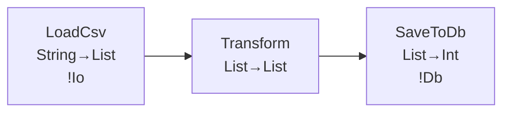

# Roadmap v21.1.0 〜 v22.0.0 — Developer Tooling Complete

Date: 2026-06-18

## 目標

v21.0「Runtime Excellence」で「VM が限界まで速い」を達成した。
次の摩擦点は「**デバッグできない**」「**カバレッジが見えない**」「**リファクタリングが怖い**」
という開発体験の問題である。

「VS Code で Favnir を書くなら Python より快適」を目指す。

**完了条件:**
1. VS Code でブレークポイントを置いて Favnir パイプラインをステップ実行できる
2. `fav test --coverage` で HTML カバレッジレポートが生成される
3. `fav explain --format mermaid` が動作する
4. LSP の `rename` が全参照を追跡してリネームできる
5. Playground でコードの共有 URL が生成できる

---

## 設計決定事項

| 項目 | 決定 |
|---|---|
| DAP 実装方針 | `fav dap`（DAP サーバー、ポート 5678）。JSON-RPC で VS Code / Neovim / Emacs と互換 |
| カバレッジ計装タイミング | `--coverage` フラグ時のみ。通常実行はゼロコスト |
| カバレッジ粒度 | 行カバレッジ + branch カバレッジ（match の各 arm） |
| lint W006〜W015 | 全10ルール追加（W001〜W005 は v17.0 実装済み） |
| LSP コードアクション | Add import / Extract to stage / Inline binding / Convert to f-string |
| Playground v2 バックエンド | 既存 WASM 基盤 + URL 短縮サービス（S3 + CloudFront）|
| fav doc サイト形式 | mdBook ライクな静的 HTML。`fav doc --serve` でローカルプレビュー |
| fav migrate 対象 | v13→v14（!Effect → Ctx 記法）。以後のバージョン移行も追加可 |

---

## バージョン計画

### v21.1 — DAP デバッガー（Debug Adapter Protocol）

**テーマ**: VS Code / Neovim から Favnir パイプラインをステップ実行できる。

#### 機能

```
- ブレークポイント設定（stage の入口・出口）
- 変数インスペクション（現在の binding の型と値を表示）
- ステップ実行（stage 単位 / 式単位）
- 条件付きブレークポイント（|r| r.amount > 1000.0 が true の行だけ止める）
- ウォッチ式（binding の変化を監視）
```

#### CLI

```bash
fav dap                 # DAP サーバーを起動（ポート 5678）
fav run --debug         # デバッグモードで実行（DAP 接続待機）
```

DAP プロトコル（JSON-RPC）は VS Code / Neovim / Emacs DAP モードと互換。

---

### v21.2 — `fav explain` 可視化強化

**テーマ**: `fav explain --lineage` をテキストからビジュアル図に昇格させる。

#### 新出力形式

```bash
# Mermaid 形式（GitHub / Notion / Obsidian で直接レンダリング）
fav explain --lineage --format mermaid src/pipeline.fav
# → pipeline.mmd

# D2 形式（インタラクティブ SVG）
fav explain --lineage --format d2 src/pipeline.fav
# → pipeline.d2

# JSON（外部ツール連携）
fav explain --lineage --format json src/pipeline.fav
```

#### Mermaid 出力例



---

### v21.3 — テストカバレッジ（`fav test --coverage`）

**テーマ**: どのパイプライン経路がテストされているか可視化する。

#### 出力形式

```bash
fav test --coverage src/
# → coverage/index.html（HTML レポート）
# → coverage/lcov.info（CI 連携用）

# サマリー表示
Coverage: 78.4% (234/298 lines)
  ✓ pipeline.fav      95.2%  (40/42)
  ✓ transform.fav     88.1%  (59/67)
  ✗ loader.fav        51.3%  (81/158)  ← 要改善
```

#### 計装方針

- stage の入口・出口に計装コードを挿入（`--coverage` フラグ時のみ）
- 行カバレッジ + branch カバレッジ（match の各 arm）
- `--coverage` なし実行では計装コードがゼロコスト

---

### v21.4 — `fav lint` 強化（W006〜W015）

**テーマ**: v17.0 の W001〜W005 に続き、より実践的なルールを追加する。

| ルール | 内容 |
|---|---|
| W006 | 巨大な stage（100 行超）— 分割を推奨 |
| W007 | エフェクトなし stage が外部 I/O を呼んでいる |
| W008 | 未使用の type 定義 |
| W009 | `List.map` + `List.filter` の連鎖 → `List.filter_map` を推奨 |
| W010 | `bind x <- Result.ok(expr)` — `Result.ok` が不要 |
| W011 | 同一 binding への再代入（E0018 と連携） |
| W012 | `match` が `_ =>` のみ — より具体的なパターンを推奨 |
| W013 | 深いネスト（4 レベル超）— 関数抽出を推奨 |
| W014 | magic number（`> 1000.0` — 名前付き定数化を推奨）|
| W015 | `String.concat` の連鎖 → f-string を推奨 |

---

### v21.5 — LSP コードアクション強化

**テーマ**: hover / diagnostics / 補完に加え、自動修正・リファクタリングを追加する。

#### コードアクション

```
- "Add missing import"    — use 文の自動追加
- "Extract to stage"      — 選択範囲を新しい stage に抽出
- "Inline binding"        — 一度しか使われない bind を展開
- "Convert to f-string"   — String.concat 連鎖を f-string に変換
```

#### リネーム

```
- stage / fn / type の一括リネーム（LSP rename）
- リネーム時に use 参照も追跡
```

#### Find References

```
- stage の全呼び出し箇所を一覧表示
- type の全使用箇所を一覧表示
```

---

### v21.6 — Playground v2（共有・フォーク・ライブ）

**テーマ**: コードの共有・発見・学習の場にする。

#### 新機能

```
- 共有 URL（パーマリンク）: https://play.favnir.dev/s/abc123
- フォーク: 他人のコードを自分の環境にコピー
- テンプレートギャラリー: よくあるパイプラインのサンプル集
- diff ビュー: 2 つのコードを比較
- 実行時間 / メモリ使用量の表示
- --format=flamegraph 出力をブラウザで表示
```

---

### v21.7 — `fav doc` サイト生成（docsite）

**テーマ**: `///` コメントから静的ドキュメントサイトを自動生成する。

```bash
fav doc --format site src/ --out docs/
# → docs/index.html, docs/pipeline.html, ...

# ローカルプレビュー
fav doc --serve src/
# → http://localhost:8080
```

mdBook / Docusaurus ライクなサイトが自動生成される。
rune パッケージを公開する際に自動でドキュメントサイトも公開できる。

---

### v21.8 — `fav migrate` 強化

**テーマ**: バージョン間の自動コード移行ツールを完成させる。

```bash
# !Effect 記法 → Ctx 記法（v14.0 移行）
fav migrate --from v13 --to v14 src/

# fav.toml 形式の移行
fav migrate --config fav.toml

# ドライラン（変更内容をプレビュー）
fav migrate --dry-run src/
```

---

## v22.0 — Developer Tooling Complete マイルストーン宣言

**完了条件:**
1. VS Code でブレークポイントを置いて Favnir パイプラインをステップ実行できる
2. `fav test --coverage` で HTML カバレッジレポートが生成される
3. `fav explain --format mermaid` が動作する
4. LSP の `rename` が全参照を追跡してリネームできる
5. Playground でコードの共有 URL が生成できる

---

## 参考リンク

- 前フェーズ: `versions/roadmap/roadmap-v20.1-v21.0.md`
- 次フェーズ: `versions/roadmap/roadmap-v22.1-v23.0.md`
- マスタースケジュール: `versions/roadmap-v20.1-v25.0.md`
