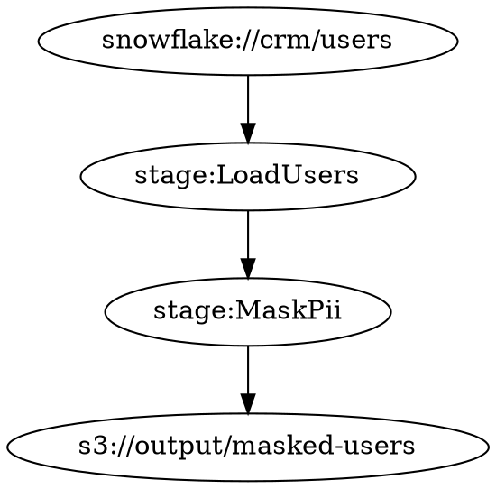

# Roadmap v75.1.0 〜 v80.0.0 — Favnir 3.0 宣言

Date: 2026-08-14
Status: 未着手（v75.0.0 完了後に開始）

マスターロードマップ（前フェーズ）: [roadmap-v70.1-v75.0.md](roadmap-v70.1-v75.0.md)

---

## 前提

- 直前完了: v75.0.0「Favnir 2.0 宣言」（tests = 3692）
- 本フェーズは Phase 6「Favnir 3.0 宣言」の詳細計画
- 目標: v80.0.0「Favnir 3.0 宣言」（tests = 3802）

### フェーズの性格

Favnir 2.0 で「型・セルフホスト・エコシステム」が揃った。
Phase 6 では「**時間・来歴・正しさ・実行戦略**」を型・エフェクト系の一貫した拡張として積み上げ、
Favnir 3.0 として統合宣言する。

各スプリントは独立して価値を持つが、ストーリーとして順に積み上がる:

```
v76.0: 「いつ」を型で保証           — Temporal Data Native
v77.0: 「どこから」を型で保証       — Data Provenance 1.0
v78.0: 「正しさ」を型で証明         — Verifiable Pipelines
v79.0: 「実行戦略」をエフェクトで宣言 — Execution Effects 1.0
v80.0: すべてが揃った               — Favnir 3.0 宣言
```

A（新言語機能）50% + B（エコシステム統合）30% + C（宣言・ドキュメント）20% の構成。

---

## スプリント一覧

| スプリント | 期間 | テーマ | テスト数 |
|---|---|---|---|
| Temporal Data Native | v75.1〜v76.0 | 時間軸型システム | 3692 → 3714（+22） |
| Data Provenance 1.0 | v76.1〜v77.0 | データ来歴型 | 3714 → 3736（+22） |
| Verifiable Pipelines | v77.1〜v78.0 | 証明可能パイプライン | 3736 → 3758（+22） |
| Execution Effects 1.0 | v78.1〜v79.0 | 実行戦略エフェクト | 3758 → 3780（+22） |
| Favnir 3.0 宣言 | v79.1〜v80.0 | 統合・宣言 | 3780 → 3802（+22） |

---

## ━━━━━━━━━━━━━━━━━━━━━━━━━━
## Sprint 1: Temporal Data Native（v75.1〜v76.0）
## ━━━━━━━━━━━━━━━━━━━━━━━━━━

**テーマ**: データエンジニアにとって「いつ時点か」は型の問題だ。
鮮度・SCD・タイムトラベルを Favnir のファーストクラス型として実現する。

### バージョン一覧

| バージョン | 内容 | テスト数 | 状態 |
|---|---|---|---|
| v75.1.0 | `FreshnessPolicy` 型基盤 | 3692 + 2 = 3694 | 未着手 |
| v75.2.0 | `TemporalRange` / `AsOfQuery` 型 | 3694 + 2 = 3696 | 未着手 |
| v75.3.0 | SCD Type 1 / Type 2 ネイティブ型 | 3696 + 2 = 3698 | 未着手 |
| v75.4.0 | Temporal join（時点結合） | 3698 + 2 = 3700 | 未着手 |
| v75.5.0 | `RetentionPolicy` 型 | 3700 + 2 = 3702 | 未着手 |
| v75.6.0 | Stream freshness monitoring | 3702 + 2 = 3704 | 未着手 |
| v75.7.0 | Temporal contracts | 3704 + 2 = 3706 | 未着手 |
| v75.8.0 | `fav time-travel` コマンド | 3706 + 2 = 3708 | 未着手 |
| v75.9.0 | 安定化・コードフリーズ | 3708 + 2 = 3710 | 未着手 |
| v76.0.0 | Temporal Data Native 宣言 ★クリーンアップ | 3710 + 4 = 3714 | 未着手 |

---

### v75.1.0 — `FreshnessPolicy` 型基盤

データの「鮮度」を型で表現する基盤。パイプラインが古いデータを最新として扱うバグをコンパイル時に検出する足がかり。

```favnir
// 鮮度ポリシー付きデータ取得
fn get_price(id: String) -> Result<Float, String> {
    bind raw <- ctx.io.read_file_raw("prices.csv")
    bind _ <- FreshnessPolicy.check(raw, max_age: Duration.minutes(5))
    Result.ok(parse_price(raw))
}
```

**実装内容:**
- `FreshnessPolicy` 構造体（max_age_secs: u64, strategy: Warn/Fail）
- `check_freshness(data_ts: i64, now: i64, policy: &FreshnessPolicy) -> bool`
- `format_freshness_warning(policy, age_secs) -> String`

**完了条件**: Rust テスト 2 件（3692 + 2 = 3694）
- `freshness_policy_enforced`
- `freshness_stale_detected`

---

### v75.2.0 — `TemporalRange` / `AsOfQuery` 型

時点クエリを型安全に表現。Snowflake / Delta Lake の `AS OF` 構文に対応。

```favnir
// タイムトラベルクエリ（Snowflake AS OF）
bind snapshot <- AsOfQuery {
    table: "orders",
    as_of: DateTime.parse("2026-01-01T00:00:00Z")
}
// → SELECT * FROM orders AS OF TIMESTAMP '2026-01-01 00:00:00'

// 期間フィルター
bind range <- TemporalRange { from: start, to: end }
bind filtered <- orders |> filter_in_range(range)
```

**実装内容:**
- `TemporalRange` 構造体（from_ts: i64, to_ts: i64）
- `AsOfQuery` 構造体（table: String, as_of_ts: i64）
- `format_as_of_query(q: &AsOfQuery) -> String` — SQL 文字列生成
- `is_in_range(ts: i64, range: &TemporalRange) -> bool`

**完了条件**: Rust テスト 2 件（3694 + 2 = 3696）
- `temporal_range_filters_correctly`
- `as_of_query_generates_sql`

---

### v75.3.0 — SCD Type 1 / Type 2 ネイティブ型

Slowly Changing Dimensions（緩やかに変化するディメンション）を型として表現。
データウェアハウスの定番パターンをファーストクラスにする。

```favnir
// SCD Type 2: 変更履歴を保持（data フィールドに JSON シリアライズ済みデータを格納）
fn upsert_customer(existing: List<ScdRow>, new_data: String, now: Int) -> List<ScdRow> {
    apply_scd2_update(existing, new_data, now)
    // → 旧レコードを valid_to で閉じ、新レコードを is_current=true で追加
}
```

**実装内容:**
- `ScdType` enum（Type1, Type2）
- `ScdRow` 構造体（valid_from: i64, valid_to: Option<i64>, is_current: bool, data: String）
- `apply_scd2_update(existing: &[ScdRow], new_data: &str, new_ts: i64) -> Vec<ScdRow>`

**完了条件**: Rust テスト 2 件（3696 + 2 = 3698）
- `scd2_creates_history_row`
- `scd2_marks_previous_expired`

---

### v75.4.0 — Temporal join（時点結合）

Point-in-time join を型安全に表現。「注文時点の商品価格」のような時系列結合を正確に表現する。

```favnir
// 注文日時点の商品価格で結合
bind result <- orders |> temporal_join(
    prices,
    key: "product_id",
    as_of_field: "order_date"
)
// → 各注文の order_date 時点で有効な価格レコードと結合
```

**実装内容:**
- `TemporalJoinConfig` 構造体（left_key, right_key, as_of_field: String）
- `format_temporal_join_sql(left_table: &str, right_table: &str, config: &TemporalJoinConfig) -> String`
- `validate_temporal_join_config(config) -> Result<(), String>` — フィールド名検証

**完了条件**: Rust テスト 2 件（3698 + 2 = 3700）
- `temporal_join_sql_generated`
- `temporal_join_invalid_config_rejected`

---

### v75.5.0 — `RetentionPolicy` 型

データ保持ポリシーを型で宣言。GDPR の「保存期間」要件をコードで表現する。

```favnir
// 保持ポリシー（v75.5.0 実装スコープ）
contract UserDataPipeline {
    retention: RetentionPolicy {
        max_age_days: 365,
        action: Anonymize
        // exclude_fields は将来拡張（v75.5.0 では未実装）
    }
}
```

**実装内容:**
- `RetentionAction` enum（Delete, Archive, Anonymize）
- `RetentionPolicy` 構造体（max_age_days: u64, action: RetentionAction）
- `apply_retention_check(row_ts: i64, now: i64, policy: &RetentionPolicy) -> RetentionResult`
- `RetentionResult` enum（Keep, Delete, Archive, Anonymize）

**完了条件**: Rust テスト 2 件（3700 + 2 = 3702）
- `retention_delete_old_rows`
- `retention_anonymize_action`

---

### v75.6.0 — Stream freshness monitoring

ストリームの遅延（lag）を監視する型基盤。Kafka / Kinesis パイプラインの鮮度を型で管理する。

```favnir
// ストリーム遅延監視（v75.6.0 実装スコープ）
fn monitor_stream(last_event_ts: Int, now_secs: Int, ctx: AppCtx) -> Result<Unit, String> {
    bind monitor <- StreamFreshnessMonitor {
        source: "kafka://orders-topic",
        max_lag_secs: 30
    }
    bind lag <- check_stream_lag(last_event_ts, now_secs, monitor)
    if lag.exceeded {
        ctx.io.println(format_stream_lag_report(lag))
    }
    Result.ok(Unit)
}
```

**実装内容:**
- `StreamFreshnessMonitor` 構造体（source: String, max_lag_secs: u64）
- `StreamLagResult` 構造体（lag_secs: u64, exceeded: bool, source: String）
- `check_stream_lag(last_event_ts: i64, now: i64, monitor: &StreamFreshnessMonitor) -> StreamLagResult`
- `format_stream_lag_report(result: &StreamLagResult) -> String`

**完了条件**: Rust テスト 2 件（3702 + 2 = 3704）
- `stream_lag_within_threshold`
- `stream_lag_exceeded_detected`

---

### v75.7.0 — Temporal contracts

コントラクトに鮮度・保持ポリシーを組み込む。時間要件をコントラクト違反として型チェックする。

```favnir
// v75.7.0 実装スコープ（Rust 内部 API）
// 将来バージョンでは `contract` キーワードとして言語統合予定
bind contract <- TemporalContract {
    name: "PricingPipeline",
    freshness: FreshnessPolicy { max_age_secs: 300, strategy: Fail },
    retention: RetentionPolicy { max_age_days: 90, action: Delete }
}
bind result <- validate_temporal_contract(contract, data_ts, now_secs)
ctx.io.println(format_temporal_contract_report(contract, result))
```

**実装内容:**
- `TemporalContract` 構造体（name: String, freshness: Option<FreshnessPolicy>, retention: Option<RetentionPolicy>）
- `validate_temporal_contract(contract: &TemporalContract, data_ts: i64, now: i64) -> Result<(), String>`
- `format_temporal_contract_report(contract, result) -> String`

**完了条件**: Rust テスト 2 件（3704 + 2 = 3706）
- `temporal_contract_freshness_violation`
- `temporal_contract_retention_exceeded`

---

### v75.8.0 — `fav time-travel` コマンド

CLI から時点クエリを手軽に発行できるコマンド。デバッグ・監査用途。

```bash
$ fav time-travel --table orders --at "2025-01-01T00:00:00Z"
SELECT * FROM orders AS OF TIMESTAMP '2025-01-01 00:00:00'

$ fav time-travel --table orders --at "2025-01-01T00:00:00Z" --format delta
SELECT * FROM orders VERSION AS OF 1735689600
```

**実装内容:**
- `TimeTravelFormat` enum（Snowflake, Delta, Generic）
- `TimeTravelQuery` 構造体（table: String, as_of_ts: i64, format: TimeTravelFormat）
- `cmd_time_travel(query: &TimeTravelQuery) -> String` — SQL 文字列生成
- `parse_time_travel_timestamp(s: &str) -> Result<i64, String>` — RFC3339 パース

**完了条件**: Rust テスト 2 件（3706 + 2 = 3708）
- `time_travel_snowflake_format`
- `time_travel_delta_format`

---

### v75.9.0 — 安定化・コードフリーズ（Temporal Data Native 前最終調整）

v75.1〜v75.8 の全機能を通しで確認する。

**完了条件**: Rust テスト 2 件（3708 + 2 = 3710）
- `temporal_full_sprint_all_stable`
- `temporal_e2e_pipeline_valid`

---

### v76.0.0 — Temporal Data Native 宣言 ★クリーンアップ

**宣言文**:
> 「鮮度が型となり、SCD が構造となり、タイムトラベルが API となった。
>  Favnir のパイプラインは今、時間軸を型で保証する。」

**完了条件**: `v76000_tests` 4 件（3710 + 4 = 3714）
- `cargo_toml_version_is_76_0_0`
- `changelog_has_v76_0_0`
- `milestone_has_temporal_data_native`
- `readme_mentions_temporal`

---

## ━━━━━━━━━━━━━━━━━━━━━━━━━━
## Sprint 2: Data Provenance 1.0（v76.1〜v77.0）
## ━━━━━━━━━━━━━━━━━━━━━━━━━━

**テーマ**: どこから来たデータかを型が保証し、GDPR はコンパイル時に通る。

### バージョン一覧

| バージョン | 内容 | テスト数 | 状態 |
|---|---|---|---|
| v76.1.0 | `DataSource` / `ProvenanceTag` 型基盤 | 3714 + 2 = 3716 | 未着手 |
| v76.2.0 | `TracedData` 型 | 3716 + 2 = 3718 | 未着手 |
| v76.3.0 | PII 来歴追跡・GDPR 消去計画 | 3718 + 2 = 3720 | 未着手 |
| v76.4.0 | OpenLineage 統合強化 | 3720 + 2 = 3722 | 未着手 |
| v76.5.0 | `fav lineage graph` 可視化 | 3722 + 2 = 3724 | 未着手 |
| v76.6.0 | Cross-pipeline provenance | 3724 + 2 = 3726 | 未着手 |
| v76.7.0 | Data product 型 | 3726 + 2 = 3728 | 未着手 |
| v76.8.0 | Provenance contracts | 3728 + 2 = 3730 | 未着手 |
| v76.9.0 | 安定化・コードフリーズ | 3730 + 2 = 3732 | 未着手 |
| v77.0.0 | Data Provenance 1.0 宣言 ★クリーンアップ | 3732 + 4 = 3736 | 未着手 |

---

### v76.1.0 — `DataSource` / `ProvenanceTag` 型基盤

データの出所を型として表現する基盤。「このデータはどのシステムから来たか」を値として持つ。

```favnir
// データソース宣言
bind source <- DataSource {
    name: "snowflake-crm",
    uri: "snowflake://warehouse/crm/users",
    source_type: Snowflake
}

// 来歴タグ
bind tag <- ProvenanceTag {
    source: source,
    transforms: ["mask_pii", "normalize_email"],
    pii: false   // マスク済み
}
```

**実装内容:**
- `DataSourceType` enum（Snowflake, S3, Api, Manual, Pipeline）
- `DataSource` 構造体（name, uri, source_type: DataSourceType）
- `ProvenanceTag` 構造体（source: DataSource, transforms: Vec<String>, pii: bool）
- `format_provenance_tag(tag: &ProvenanceTag) -> String`

**完了条件**: Rust テスト 2 件（3714 + 2 = 3716）
- `provenance_tag_created`
- `provenance_pii_flagged`

---

### v76.2.0 — `TracedData` 型

データに来歴を付けて持ち回る型。変換を経ても来歴が追跡できる。

```favnir
// 来歴付きデータ変換
bind raw    <- TracedData.wrap(rows, source)
bind masked <- raw |> TracedData.map(mask_pii, label: "mask_pii")
// → masked.provenance.transforms = ["mask_pii"]
// → masked.provenance.pii = false（マスク後）
```

**実装内容:**
- `TracedData` 構造体（data: String（シリアライズ済み）, provenance: ProvenanceTag）
- `map_traced(t: TracedData, transform_label: &str) -> TracedData` — 変換ラベルを provenance に追記
- `merge_provenance(a: &ProvenanceTag, b: &ProvenanceTag) -> ProvenanceTag` — join 時の来歴マージ（pii は OR）

**完了条件**: Rust テスト 2 件（3716 + 2 = 3718）
- `traced_map_appends_transform`
- `traced_merge_propagates_pii`

---

### v76.3.0 — PII 来歴追跡・GDPR 消去計画

PII を含むデータの流れを追跡し、GDPR「忘れられる権利」への対応計画を自動生成する。

```bash
$ fav lineage pii-report pipeline.fav
PII Fields Detected:
  Stage 1 (LoadUsers): email, phone → source: snowflake://crm/users
  Stage 2 (MaskPii):   email ✓ masked, phone ✓ masked
  Stage 3 (Export):    No PII fields — safe to export

GDPR Erasure Plan:
  User ID 12345 → delete from: snowflake://crm/users (field: email)
```

**実装内容:**
- `PiiProvenanceReport` 構造体（fields: Vec<String>, source_uri: String, masked: bool）
- `detect_pii_in_tag(tag: &ProvenanceTag) -> Vec<String>` — pii=true のタグから PII フィールドを返す
- `ErasurePlan` 構造体（target_uri: String, fields: Vec<String>, reason: String）
- `generate_erasure_plan(tag: &ProvenanceTag) -> Option<ErasurePlan>`

**完了条件**: Rust テスト 2 件（3718 + 2 = 3720）
- `pii_detected_in_provenance`
- `gdpr_erasure_plan_generated`

---

### v76.4.0 — OpenLineage 統合強化

`ProvenanceTag` を OpenLineage ファセットに変換し、標準的なリネージ追跡ツールと統合する。

```favnir
// OpenLineage facet 生成
bind facet <- OpenLineage.from_provenance(tag)
// → {
//     "_producer": "favnir/v76",
//     "dataSource": { "uri": "snowflake://crm/users" },
//     "columnLineage": { ... }
//   }
```

**実装内容:**
- `OpenLineageFacet` 構造体（producer: String, data_source_uri: String, transforms: Vec<String>）
- `provenance_to_openlineage(tag: &ProvenanceTag) -> OpenLineageFacet`
- `format_openlineage_json(facet: &OpenLineageFacet) -> String` — JSON 文字列生成

**完了条件**: Rust テスト 2 件（3720 + 2 = 3722）
- `openlineage_facet_from_provenance`
- `openlineage_json_format`

---

### v76.5.0 — `fav lineage graph` 可視化

パイプラインのリネージグラフを Graphviz DOT 形式で出力。視覚的なデータフロー確認を実現する。

```bash
$ fav lineage graph pipeline.fav --format dot > lineage.dot
$ dot -Tpng lineage.dot -o lineage.png
```



**実装内容:**
- `LineageNodeType` enum（Source, Transform, Sink）
- `LineageNode` 構造体（id: String, node_type: LineageNodeType, label: String）
- `LineageEdge` 構造体（from: String, to: String）
- `LineageGraph` 構造体（nodes: Vec<LineageNode>, edges: Vec<LineageEdge>）
- `format_lineage_dot(graph: &LineageGraph) -> String`

**完了条件**: Rust テスト 2 件（3722 + 2 = 3724）
- `lineage_graph_built`
- `lineage_dot_format`

---

### v76.6.0 — Cross-pipeline provenance

複数のパイプラインを跨いだ来歴の連鎖を表現する。上流パイプラインの来歴を下流に引き継ぐ。

```favnir
// パイプライン A の出力を B が入力として使う場合
bind chain <- PipelineProvenanceChain {
    pipelines: ["etl-pipeline-a", "ml-pipeline-b"],
    inherited_tag: pipeline_a_output.provenance
}
// → B の来歴に A の出所が引き継がれる
```

**実装内容:**
- `PipelineProvenanceChain` 構造体（pipelines: Vec<String>, merged_tag: ProvenanceTag）
- `chain_provenance(upstream: &ProvenanceTag, pipeline_name: &str) -> ProvenanceTag`
  — upstream を親として新しい ProvenanceTag を生成（transforms に pipeline_name を追加）
- `format_chain_report(chain: &PipelineProvenanceChain) -> String`

**完了条件**: Rust テスト 2 件（3724 + 2 = 3726）
- `cross_pipeline_provenance_chained`
- `cross_pipeline_pii_propagated`

---

### v76.7.0 — Data product 型

データ製品（Data Product）をファーストクラス型として表現。データメッシュアーキテクチャの基盤。

```favnir
// データ製品定義
bind product <- DataProduct {
    name: "customer-360",
    owner: "data-platform-team",
    sla: { freshness_minutes: 60 },
    provenance_policy: ProvenancePolicy { require_source_declared: true, pii_must_be_masked: true }
}

// 検証
bind _ <- DataProduct.validate(product)
```

**実装内容:**
- `DataProductSla` 構造体（freshness_minutes: u64）
- `ProvenancePolicy` 構造体（require_source_declared: bool, pii_must_be_masked: bool）
- `DataProduct` 構造体（name, owner: String, sla: DataProductSla, provenance_policy: ProvenancePolicy）
- `validate_data_product(product: &DataProduct, tag: &ProvenanceTag) -> Result<(), String>`

**完了条件**: Rust テスト 2 件（3726 + 2 = 3728）
- `data_product_validated`
- `data_product_pii_policy_violated`

---

### v76.8.0 — Provenance contracts

コントラクトに来歴ポリシーを組み込む。「このパイプラインの入力は必ず Snowflake から来ること」を型で保証する。

```favnir
contract ExportPipeline {
    input:  { rows: List<Row> }
    output: { exported: Bool }
    provenance: ProvenanceContract {
        allowed_sources: [Snowflake, S3],
        pii_policy: MustBeMasked
    }
}
// → 入力の ProvenanceTag が Snowflake/S3 以外、または pii=true ならコンパイルエラー
```

**実装内容:**
- `PiiPolicy` enum（MustBeMasked, AllowRaw, MustBeAbsent）
- `ProvenanceContract` 構造体（allowed_sources: Vec<DataSourceType>, pii_policy: PiiPolicy）
- `validate_provenance_contract(contract: &ProvenanceContract, tag: &ProvenanceTag) -> Result<(), String>`

**完了条件**: Rust テスト 2 件（3728 + 2 = 3730）
- `provenance_contract_source_violation`
- `provenance_contract_pii_violation`

---

### v76.9.0 — 安定化・コードフリーズ（Data Provenance 前最終調整）

**完了条件**: Rust テスト 2 件（3730 + 2 = 3732）
- `provenance_full_sprint_all_stable`
- `provenance_e2e_pipeline_valid`

---

### v77.0.0 — Data Provenance 1.0 宣言 ★クリーンアップ

**宣言文**:
> 「データの来歴が型となった。どこから来て、何を経て、PII がどこで消えたかを
>  Favnir が型で追跡する。GDPR はコンパイル時に通る。」

**完了条件**: `v77000_tests` 4 件（3732 + 4 = 3736）
- `cargo_toml_version_is_77_0_0`
- `changelog_has_v77_0_0`
- `milestone_has_data_provenance`
- `readme_mentions_provenance`

---

## ━━━━━━━━━━━━━━━━━━━━━━━━━━
## Sprint 3: Verifiable Pipelines（v77.1〜v78.0）
## ━━━━━━━━━━━━━━━━━━━━━━━━━━

**テーマ**: テストを書く前に、コンパイラが反例を見つける。
パイプラインの不変条件をコントラクトとして宣言し、`fav verify` で証明する。

### バージョン一覧

| バージョン | 内容 | テスト数 | 状態 |
|---|---|---|---|
| v77.1.0 | `PipelineInvariant` 型基盤 | 3736 + 2 = 3738 | 未着手 |
| v77.2.0 | フィルター系不変条件 | 3738 + 2 = 3740 | 未着手 |
| v77.3.0 | 集約系不変条件 | 3740 + 2 = 3742 | 未着手 |
| v77.4.0 | Join 系不変条件 | 3742 + 2 = 3744 | 未着手 |
| v77.5.0 | `fav verify` コマンド | 3744 + 2 = 3746 | 未着手 |
| v77.6.0 | 証明付き CI 統合 | 3746 + 2 = 3748 | 未着手 |
| v77.7.0 | 反例自動生成 | 3748 + 2 = 3750 | 未着手 |
| v77.8.0 | Probabilistic contracts | 3750 + 2 = 3752 | 未着手 |
| v77.9.0 | 安定化・コードフリーズ | 3752 + 2 = 3754 | 未着手 |
| v78.0.0 | Verifiable Pipelines 宣言 ★クリーンアップ | 3754 + 4 = 3758 | 未着手 |

---

### v77.1.0 — `PipelineInvariant` 型基盤

パイプラインの不変条件を型として表現する基盤。`contract` ブロックに `invariant` 節を追加する。

```favnir
contract OrderPipeline {
    input:  { orders: List<Row> }
    output: { processed: List<Row> }
    invariant: output.row_count <= input.row_count    // フィルターは増やさない
    invariant: output.total_amount >= 0.0             // 合計は非負
}
```

**実装内容:**
- `InvariantCheckPoint` enum（Pre, Post, Both）
- `PipelineInvariant` 構造体（name: String, expression: String, check_point: InvariantCheckPoint）
- `InvariantViolation` 構造体（invariant_name: String, expected: String, actual: String）
- `check_count_invariant(expected_max: usize, actual: usize) -> Result<(), InvariantViolation>`

**完了条件**: Rust テスト 2 件（3736 + 2 = 3738）
- `invariant_count_passes`
- `invariant_count_violated`

---

### v77.2.0 — フィルター系不変条件

フィルター操作が持つべき性質（行数が減る・比率の上限など）を不変条件として検証する。

```favnir
contract FilterPipeline {
    invariant filter_reduces_rows:
        output.row_count < input.row_count
    invariant filter_ratio_reasonable:
        (output.row_count as Float / input.row_count as Float) >= 0.01
        // → 99% 以上フィルターされたら警告
}
```

**実装内容:**
- `FilterInvariant` 構造体（expected_ratio_min: f64, expected_ratio_max: f64）
- `check_filter_invariant(input_count: usize, output_count: usize, inv: &FilterInvariant) -> Result<(), InvariantViolation>`
- `format_filter_invariant_report(inv, result) -> String`

**完了条件**: Rust テスト 2 件（3738 + 2 = 3740）
- `filter_invariant_ratio_valid`
- `filter_invariant_ratio_violated`

---

### v77.3.0 — 集約系不変条件

集約結果（SUM・COUNT・AVG）が持つべき数学的性質を不変条件として検証する。

```favnir
contract AggregatePipeline {
    invariant total_amount_non_negative: SUM(output.amount) >= 0.0
    invariant avg_score_bounded: AVG(output.score) BETWEEN 0.0 AND 100.0
}
```

**実装内容:**
- `AggregateProperty` enum（NonNegative, NonPositive, Bounded { min: f64, max: f64 }, NonNull）
- `AggregateInvariant` 構造体（column: String, property: AggregateProperty）
- `check_aggregate_invariant(values: &[f64], inv: &AggregateInvariant) -> Result<(), InvariantViolation>`

**完了条件**: Rust テスト 2 件（3740 + 2 = 3742）
- `aggregate_invariant_non_negative_passes`
- `aggregate_invariant_bounded_violated`

---

### v77.4.0 — Join 系不変条件

Join の種類に応じた不変条件（行数の増減・NULL 発生）を検証する。

```favnir
contract JoinPipeline {
    invariant inner_join_no_nulls:
        output.rows |> all(row => row.customer_id != null)
    invariant left_join_preserves_left:
        output.row_count >= input.left.row_count
}
```

**実装内容:**
- `JoinType` enum（Inner, Left, Right, Full）
- `JoinNullPolicy` enum（Fail, Warn, Allow）
- `JoinInvariant` 構造体（join_type: JoinType, null_policy: JoinNullPolicy）
- `check_join_invariant(left_count: usize, result_count: usize, null_count: usize, inv: &JoinInvariant) -> Result<(), InvariantViolation>`

**完了条件**: Rust テスト 2 件（3742 + 2 = 3744）
- `join_invariant_inner_no_nulls`
- `join_invariant_left_preserves_rows`

---

### v77.5.0 — `fav verify` コマンド

コントラクトの不変条件をサンプルデータに対して検証するコマンド。

```bash
$ fav verify pipeline.fav --data data/sample.csv
Verifying OrderPipeline...
  ✓ filter_reduces_rows       (input=1000, output=847)
  ✓ total_amount_non_negative (sum=49823.5)
  ⚠ filter_ratio_reasonable   (ratio=0.847 — within threshold)
Verification passed. 3/3 invariants checked.
```

**実装内容:**
- `InvariantResult` 構造体（name: String, passed: bool, detail: String）
- `VerificationReport` 構造体（pipeline: String, results: Vec<InvariantResult>, all_passed: bool）
- `cmd_verify(pipeline_name: &str, invariants: &[PipelineInvariant]) -> VerificationReport`
- `format_verification_report(report: &VerificationReport) -> String`

**完了条件**: Rust テスト 2 件（3744 + 2 = 3746）
- `verify_cmd_all_pass`
- `verify_cmd_violation_reported`

---

### v77.6.0 — 証明付き CI 統合

CI パイプライン（GitHub Actions など）で `fav verify` を自動実行し、不変条件の証明をブロッカーにする。

```yaml
# .github/workflows/verify.yml
- name: Verify invariants
  run: fav verify pipelines/order.fav --fail-on-violation
```

**実装内容:**
- `CiVerificationConfig` 構造体（pipeline: String, fail_fast: bool, data_path: String）
- `CiResult` 構造体（passed: bool, report: VerificationReport, exit_code: i32）
- `run_ci_verification(config: &CiVerificationConfig, invariants: &[PipelineInvariant]) -> CiResult`
- `format_ci_result_summary(result: &CiResult) -> String`

**完了条件**: Rust テスト 2 件（3746 + 2 = 3748）
- `ci_verification_passes`
- `ci_verification_fails_on_violation`

---

### v77.7.0 — 反例自動生成

不変条件を「破る」サンプルデータを自動生成する。不変条件の設計ミスを早期に発見する。

```bash
$ fav verify --generate-counter-examples pipeline.fav
Generating counter-examples for: total_amount_non_negative
  Counter-example found: amount = [-1.0, 5.0, 3.0] → sum = 7.0 (passes)
  Counter-example found: amount = [-100.0] → sum = -100.0 (VIOLATES)
  → Invariant is reachable. Recommend adding input validation.
```

**実装内容:**
- `CounterExampleResult` 構造体（invariant_name: String, example: Vec<f64>, violates: bool）
- `generate_counter_example_values(inv: &AggregateInvariant, seed: u64) -> CounterExampleResult`
  — 境界値付近のサンプル（0.0, -0.001, f64::MIN, etc.）を生成して検証

**完了条件**: Rust テスト 2 件（3748 + 2 = 3750）
- `counter_example_finds_violation`
- `counter_example_none_for_trivially_valid`

---

### v77.8.0 — Probabilistic contracts

確率的にしか検証できない不変条件（サンプリングベース）を表現する。大規模データ向け。

```favnir
contract LargeDataPipeline {
    // 100万行全件ではなく 1% サンプルで検証
    probabilistic_invariant score_distribution:
        confidence: 0.95,
        sample_size: 10_000,
        property: AVG(score) BETWEEN 40.0 AND 60.0
}
```

**実装内容:**
- `ProbabilisticContract` 構造体（name: String, confidence: f64, sample_size: usize）
- `check_probabilistic_invariant(samples: &[f64], target_min: f64, target_max: f64, contract: &ProbabilisticContract) -> Result<(), String>`
  — サンプル平均が範囲内かを検証（信頼区間は簡易実装）

**完了条件**: Rust テスト 2 件（3750 + 2 = 3752）
- `probabilistic_contract_passes`
- `probabilistic_contract_low_confidence_fails`

---

### v77.9.0 — 安定化・コードフリーズ（Verifiable Pipelines 前最終調整）

**完了条件**: Rust テスト 2 件（3752 + 2 = 3754）
- `verifiable_full_sprint_all_stable`
- `verifiable_e2e_pipeline_verified`

---

### v78.0.0 — Verifiable Pipelines 宣言 ★クリーンアップ

**宣言文**:
> 「不変条件が型となり、反例がコンパイラから届く。
>  Favnir のパイプラインは今、その正しさを証明できる。」

**完了条件**: `v78000_tests` 4 件（3754 + 4 = 3758）
- `cargo_toml_version_is_78_0_0`
- `changelog_has_v78_0_0`
- `milestone_has_verifiable_pipelines`
- `readme_mentions_verifiable_pipelines`

---

## ━━━━━━━━━━━━━━━━━━━━━━━━━━
## Sprint 4: Execution Effects 1.0（v78.1〜v79.0）
## ━━━━━━━━━━━━━━━━━━━━━━━━━━

**テーマ**: 実行戦略をエフェクトで宣言する。`!Cached` / `!Adaptive` / `!Parallel` を
エフェクト型として統一し、パイプラインの「どう動くか」を型で制御する。

### バージョン一覧

| バージョン | 内容 | テスト数 | 状態 |
|---|---|---|---|
| v78.1.0 | `!Cached` エフェクト基盤 | 3758 + 2 = 3760 | 未着手 |
| v78.2.0 | キャッシュ戦略型（LRU / FIFO / LFU） | 3760 + 2 = 3762 | 未着手 |
| v78.3.0 | `!Adaptive` エフェクト基盤 | 3762 + 2 = 3764 | 未着手 |
| v78.4.0 | コスト推定モデル | 3764 + 2 = 3766 | 未着手 |
| v78.5.0 | `fav explain plan` 可視化 | 3766 + 2 = 3768 | 未着手 |
| v78.6.0 | `!Parallel` エフェクト統合 | 3768 + 2 = 3770 | 未着手 |
| v78.7.0 | Stream / Batch 統合実行モード | 3770 + 2 = 3772 | 未着手 |
| v78.8.0 | 実行計画キャッシュ | 3772 + 2 = 3774 | 未着手 |
| v78.9.0 | 安定化・コードフリーズ | 3774 + 2 = 3776 | 未着手 |
| v79.0.0 | Execution Effects 1.0 宣言 ★クリーンアップ | 3776 + 4 = 3780 | 未着手 |

---

### v78.1.0 — `!Cached` エフェクト基盤

関数の結果をキャッシュすることを宣言するエフェクト。繰り返し呼ばれる参照データ取得に有効。

```favnir
// キャッシュ付き関数宣言
fn get_exchange_rate(currency: String) -> Result<Float, String> !Cached {
    ctx.io.fetch(f"https://api.rates.io/{currency}")
    // → 同じ currency への呼び出しは TTL 内でキャッシュから返す
}

// fav.toml でキャッシュ設定
[effects.cached]
ttl_secs   = 300
strategy   = "lru"
max_entries = 1000
```

**実装内容:**
- `CacheStrategy` enum（Lru, Fifo, Lfu）
- `CacheConfig` 構造体（ttl_secs: u64, strategy: CacheStrategy, max_entries: usize）
- `CacheEntry` 構造体（key: String, inserted_at: i64, hits: u64）
- `check_cache_valid(entry: &CacheEntry, now: i64, config: &CacheConfig) -> bool`

**完了条件**: Rust テスト 2 件（3758 + 2 = 3760）
- `cache_entry_valid_within_ttl`
- `cache_entry_expired`

---

### v78.2.0 — キャッシュ戦略型（LRU / FIFO / LFU）

各キャッシュ戦略の動作を型として表現し、ヒット率・エビクション数などの統計を扱う。

```favnir
// キャッシュ統計レポート
$ fav cache stats --pipeline pipeline.fav
Cache Stats:
  hits:      8432 (84.3%)
  misses:    1568
  evictions: 204
  strategy:  LRU (max=1000 entries)
```

**実装内容:**
- `CacheStats` 構造体（hits: u64, misses: u64, evictions: u64）
- `simulate_lru_cache(accesses: &[String], max_entries: usize) -> CacheStats`
- `format_cache_stats_report(stats: &CacheStats) -> String`
- `hit_rate(stats: &CacheStats) -> f64`

**完了条件**: Rust テスト 2 件（3760 + 2 = 3762）
- `lru_evicts_least_recently_used`
- `cache_hit_rate_calculated`

---

### v78.3.0 — `!Adaptive` エフェクト基盤

実行戦略をランタイム統計に基づいて自動選択することを宣言するエフェクト。

```favnir
// 結合戦略を自動選択
fn join_customers(ctx: AppCtx) -> Result<List<Row>, String> !Adaptive {
    bind customers <- ctx.io.query("SELECT * FROM customers")
    bind orders    <- ctx.io.query("SELECT * FROM orders")
    // → row 数が少なければ broadcast join、多ければ hash join を自動選択
    Result.ok(customers |> join(orders, on: "id"))
}

// fav.toml で閾値設定
[effects.adaptive]
broadcast_threshold_rows = 10_000
default_parallelism      = 8
```

**実装内容:**
- `ExecutionStrategy` enum（BroadcastJoin, HashJoin, SortMergeJoin, Auto）
- `AdaptiveConfig` 構造体（broadcast_threshold_rows: u64, default_parallelism: usize）
- `select_join_strategy(left_rows: u64, right_rows: u64, config: &AdaptiveConfig) -> ExecutionStrategy`
- `format_strategy_selected(strategy: &ExecutionStrategy) -> String`

**完了条件**: Rust テスト 2 件（3762 + 2 = 3764）
- `adaptive_selects_broadcast_for_small_table`
- `adaptive_selects_hash_for_large_table`

---

### v78.4.0 — コスト推定モデル

各実行戦略のコスト（CPU・メモリ・IO）を推定し、最適戦略を選択するモデル。

```bash
$ fav explain plan pipeline.fav --estimate-cost
Join Strategy Analysis:
  BroadcastJoin: CPU=2.1 units, Mem=128MB,  IO=45k ops  ← selected
  HashJoin:      CPU=5.8 units, Mem=512MB,  IO=12k ops
  SortMerge:     CPU=8.2 units, Mem=256MB,  IO=98k ops
```

**実装内容:**
- `CostEstimate` 構造体（cpu_units: f64, memory_mb: f64, io_ops: u64）
- `estimate_broadcast_cost(right_rows: u64) -> CostEstimate`
- `estimate_hash_cost(left_rows: u64, right_rows: u64) -> CostEstimate`
- `select_min_cost_strategy(estimates: &[(ExecutionStrategy, CostEstimate)]) -> ExecutionStrategy`

**完了条件**: Rust テスト 2 件（3764 + 2 = 3766）
- `cost_estimate_broadcast_cheaper_for_small`
- `cost_estimate_hash_wins_for_large`

---

### v78.5.0 — `fav explain plan` 可視化

パイプラインの実行計画をテキスト形式で可視化するコマンド。

```bash
$ fav explain plan pipeline.fav
Execution Plan: OrderPipeline
  Stage 1: LoadOrders          [IO]       cost=1.2 units
  Stage 2: JoinCustomers       [Adaptive] cost=2.1 units  → BroadcastJoin selected
  Stage 3: AggregateByRegion   [Cached]   cost=0.3 units  → cache hit expected
  ─────────────────────────────────────────────────────
  Total estimated cost: 3.6 units  |  Memory peak: 128MB
```

**実装内容:**
- `PlanStage` 構造体（name: String, operation: String, cost: CostEstimate, strategy: Option<ExecutionStrategy>）
- `ExecutionPlan` 構造体（pipeline: String, stages: Vec<PlanStage>, total_cost: CostEstimate）
- `format_execution_plan(plan: &ExecutionPlan) -> String`

**完了条件**: Rust テスト 2 件（3766 + 2 = 3768）
- `explain_plan_format_output`
- `explain_plan_total_cost_summed`

---

### v78.6.0 — `!Parallel` エフェクト統合

既存の `par [A, B]` 構文と `!Parallel` エフェクトを統合し、並列設定を宣言的に制御する。

```favnir
// エフェクトで並列宣言（par の代替・統合）
fn process_shards(ctx: AppCtx) -> Result<List<Row>, String> !Parallel {
    // → fav.toml の [effects.parallel] 設定に従ってスレッド分割
    bind results <- List.map(shards, process_shard)
    Result.ok(List.flatten(results))
}

[effects.parallel]
threads         = 8
partition_count = 16
partition_key   = "tenant_id"
```

**実装内容:**
- `ParallelConfig` 構造体（threads: usize, partition_count: usize, partition_key: String）
- `PartitionPlan` 構造体（partition_id: usize, rows_estimate: u64, thread_id: usize）
- `plan_parallel_execution(total_rows: u64, config: &ParallelConfig) -> Vec<PartitionPlan>`
- `format_parallel_plan(plans: &[PartitionPlan]) -> String`

**完了条件**: Rust テスト 2 件（3768 + 2 = 3770）
- `parallel_plan_creates_correct_partitions`
- `parallel_plan_distributes_evenly`

---

### v78.7.0 — Stream / Batch 統合実行モード

同一パイプラインをデータ量・レイテンシ要件に応じて Streaming / Batch で自動切り替えする。

```favnir
fn ingest(ctx: AppCtx) -> Result<Unit, String> !Adaptive {
    // データが少なくレイテンシ要件が厳しければ Streaming、大量データなら Batch を自動選択
    bind mode <- ExecutionMode.select(ctx.config)
    match mode {
        Streaming -> stream_ingest(ctx)
        Batch     -> batch_ingest(ctx)
    }
}
```

**実装内容:**
- `ExecutionMode` enum（Batch, Streaming, Adaptive）
- `ExecutionModeSelector` 構造体（row_threshold: u64, latency_target_ms: u64）
- `select_execution_mode(est_rows: u64, latency_target_ms: u64, selector: &ExecutionModeSelector) -> ExecutionMode`

**完了条件**: Rust テスト 2 件（3770 + 2 = 3772）
- `mode_batch_for_large_data`
- `mode_streaming_for_low_latency`

---

### v78.8.0 — 実行計画キャッシュ

同じパイプラインへの繰り返し実行で実行計画を再利用し、計画生成のオーバーヘッドを削減する。

```favnir
// 実行計画のキャッシュ（パイプラインのハッシュをキーに）
bind plan <- PlanCache.lookup(pipeline_hash)
match plan {
    Some(p) -> p          // キャッシュヒット
    None    -> {
        bind p <- plan_pipeline(pipeline)
        bind _ <- PlanCache.insert(pipeline_hash, p)
        p
    }
}
```

**実装内容:**
- `PlanCacheEntry` 構造体（pipeline_hash: String, plan: ExecutionPlan, created_at: i64）
- `PlanCache` 構造体（entries: Vec<PlanCacheEntry>, max_size: usize）
- `lookup_plan<'a>(cache: &'a PlanCache, hash: &str) -> Option<&'a ExecutionPlan>`
- `insert_plan(cache: &mut PlanCache, hash: &str, plan: ExecutionPlan)` — LRU エビクション付き

**完了条件**: Rust テスト 2 件（3772 + 2 = 3774）
- `plan_cache_hit`
- `plan_cache_evicts_oldest_on_full`

---

### v78.9.0 — 安定化・コードフリーズ（Execution Effects 前最終調整）

**完了条件**: Rust テスト 2 件（3774 + 2 = 3776）
- `execution_effects_full_sprint_all_stable`
- `execution_effects_e2e_pipeline_runs`

---

### v79.0.0 — Execution Effects 1.0 宣言 ★クリーンアップ

**宣言文**:
> 「`!Cached` がメモを持ち、`!Adaptive` が状況を読み、`!Parallel` が仕事を分ける。
>  実行戦略が型となった Favnir は、最適解を自ら選ぶ。」

**完了条件**: `v79000_tests` 4 件（3776 + 4 = 3780）
- `cargo_toml_version_is_79_0_0`
- `changelog_has_v79_0_0`
- `milestone_has_execution_effects`
- `readme_mentions_execution_effects`

---

## ━━━━━━━━━━━━━━━━━━━━━━━━━━
## Sprint 5: Favnir 3.0 宣言（v79.1〜v80.0）
## ━━━━━━━━━━━━━━━━━━━━━━━━━━

**テーマ**: 4スプリントを統合し、Favnir 3.0 として世界に宣言する。
新規機能は最小限。統合ショーケース・ドキュメント完全化・宣言が中心。

### バージョン一覧

| バージョン | 内容 | テスト数 | 状態 |
|---|---|---|---|
| v79.1.0 | 統合ショーケース基盤（`infra/e2e-demo/favnir3-showcase/`） | 3780 + 2 = 3782 | 未着手 |
| v79.2.0 | Temporal showcase パイプライン | 3782 + 2 = 3784 | 未着手 |
| v79.3.0 | Provenance showcase パイプライン | 3784 + 2 = 3786 | 未着手 |
| v79.4.0 | Verifiable showcase パイプライン | 3786 + 2 = 3788 | 未着手 |
| v79.5.0 | Execution Effects showcase パイプライン | 3788 + 2 = 3790 | 未着手 |
| v79.6.0 | ドッグフーディング強化 | 3790 + 2 = 3792 | 未着手 |
| v79.7.0 | OSS 公開強化・コミュニティ整備 | 3792 + 2 = 3794 | 未着手 |
| v79.8.0 | ドキュメント完全化（v3 リファレンス） | 3794 + 2 = 3796 | 未着手 |
| v79.9.0 | 安定化・コードフリーズ（Favnir 3.0 前最終調整） | 3796 + 2 = 3798 | 未着手 |
| v80.0.0 | Favnir 3.0 宣言 ★クリーンアップ | 3798 + 4 = 3802 | 未着手 |

---

### v79.1.0 — 統合ショーケース基盤

Favnir 3.0 の 4 スプリントすべての機能を網羅するショーケースの骨格を作成する。

```
infra/e2e-demo/favnir3-showcase/
├── pipeline.fav     # 4スプリント全機能統合パイプライン
├── fav.toml         # !Cached / !Adaptive / !Parallel 設定
├── contract.fav     # Temporal + Provenance + Verifiable コントラクト
└── README.md        # 概要・実行手順
```

**完了条件**: Rust テスト 2 件（3780 + 2 = 3782）
- `favnir3_showcase_structure_exists`
- `favnir3_showcase_contract_valid`

---

### v79.2.0 — Temporal showcase パイプライン

ショーケースに Temporal 機能（鮮度チェック・SCD・タイムトラベル）を組み込む。

```favnir
// pipeline.fav の Temporal セクション
bind prices <- AsOfQuery { table: "prices", as_of: ctx.run_date }
bind _ <- FreshnessPolicy.check(prices, max_age: Duration.hours(1))
bind history <- ScdType2.apply(customers, new_records, key: "id")
```

**完了条件**: Rust テスト 2 件（3782 + 2 = 3784）
- `showcase_temporal_freshness_check`
- `showcase_temporal_scd2_applied`

---

### v79.3.0 — Provenance showcase パイプライン

ショーケースに Provenance 機能（来歴追跡・GDPR 消去計画・OpenLineage）を組み込む。

```favnir
// pipeline.fav の Provenance セクション
bind raw: TracedData<List<Row>> <- TracedData.load(snowflake_source, ctx.io)
bind masked <- raw |> TracedData.map(mask_pii, label: "mask_pii")
bind lineage <- OpenLineage.from_provenance(masked.provenance)
```

**完了条件**: Rust テスト 2 件（3784 + 2 = 3786）
- `showcase_provenance_traced`
- `showcase_provenance_openlineage_generated`

---

### v79.4.0 — Verifiable showcase パイプライン

ショーケースに不変条件検証（`fav verify`）を組み込む。

```favnir
// contract.fav の Verifiable セクション
contract Favnir3ShowcaseContract {
    invariant row_count_reduces: output.row_count <= input.row_count
    invariant total_non_negative: SUM(output.amount) >= 0.0
    probabilistic_invariant score_dist:
        confidence: 0.95, sample_size: 1000,
        property: AVG(score) BETWEEN 40.0 AND 60.0
}
```

**完了条件**: Rust テスト 2 件（3786 + 2 = 3788）
- `showcase_verifiable_invariants_declared`
- `showcase_verifiable_probabilistic_contract`

---

### v79.5.0 — Execution Effects showcase パイプライン

ショーケースに実行戦略エフェクトを組み込む。

```favnir
// pipeline.fav の Execution Effects セクション
fn join_stage(ctx: AppCtx) -> Result<List<Row>, String> !Adaptive !Cached {
    bind customers <- get_customers(ctx)   // !Cached — TTL 5分
    bind orders    <- get_orders(ctx)
    Result.ok(customers |> join(orders, on: "id"))
    // !Adaptive — row 数に応じて broadcast/hash を自動選択
}
```

**完了条件**: Rust テスト 2 件（3788 + 2 = 3790）
- `showcase_execution_cached_effect`
- `showcase_execution_adaptive_effect`

---

### v79.6.0 — ドッグフーディング強化

Favnir 自身のリリースパイプラインを Favnir で記述する（セルフホスト精神の継続）。

```
fav/pipelines/
├── release.fav        # バージョンバンプ・CHANGELOG 生成・tag push
├── benchmark.fav      # ベンチマーク実行・結果比較
└── health-check.fav   # cargo test + fav verify の CI ヘルスチェック
```

**完了条件**: Rust テスト 2 件（3790 + 2 = 3792）
- `dogfood_release_pipeline_exists`
- `dogfood_health_check_pipeline_exists`

---

### v79.7.0 — OSS 公開強化・コミュニティ整備

Rune マーケットプレイスと OSS コントリビュートフローを強化する。

```
- CONTRIBUTING.md v2（v3 対応・新機能エフェクトの追加手順）
- Rune マーケットプレイス検証ガイド（validate_rune_score 利用手順）
- .github/CODEOWNERS 更新
- COMMUNITY.md（ディスカッションチャンネル・RFC プロセス）
```

**完了条件**: Rust テスト 2 件（3792 + 2 = 3794）
- `oss_contributing_v2_exists`
- `oss_community_md_exists`

---

### v79.8.0 — ドキュメント完全化（v3 リファレンス）

4スプリントで追加した全機能のドキュメントを完全化する。

```
site/content/docs/v3/
├── temporal.mdx          # FreshnessPolicy / AsOfQuery / SCD / time-travel
├── provenance.mdx        # TracedData / ProvenanceTag / lineage graph
├── verifiable.mdx        # PipelineInvariant / fav verify / counter-examples
├── execution-effects.mdx # !Cached / !Adaptive / !Parallel / explain plan
└── migration-v2-v3.mdx   # v2 → v3 移行ガイド
```

**完了条件**: Rust テスト 2 件（3794 + 2 = 3796）
- `docs_v3_temporal_exists`
- `docs_v3_migration_guide_exists`

---

### v79.9.0 — 安定化・コードフリーズ（Favnir 3.0 前最終調整）

v75.1〜v79.8 の全機能を通しで確認する最終安定化スプリント。

**完了条件**: Rust テスト 2 件（3796 + 2 = 3798）
- `favnir3_full_sprint_all_stable`
- `favnir3_e2e_showcase_runs`

---

### v80.0.0 — Favnir 3.0 宣言 ★クリーンアップ

**宣言文**:
> 「時間が型となり、来歴が型となり、正しさが型となり、実行戦略が型となった。
>
>  FreshnessPolicy がデータの鮮度を保証し、ProvenanceTag が来歴を追い、
>  PipelineInvariant が不変条件を証明し、!Adaptive がコストを最適化する。
>
>  Favnir 3.0 は、データパイプラインが「何を・どこから・どう正しく・どう速く」
>  処理するかを、すべて型で語れる言語である。」

**クリーンアップ作業:**
- `cargo clean` 実施
- `Cargo.toml` バージョンを `80.0.0` に更新
- `CHANGELOG.md` に v80.0.0 エントリを追加
- `MILESTONE.md` に「Favnir 3.0」を追記
- `README.md` に v80.0 達成（Favnir 3.0）を追記
- `versions/current.md` を更新

**完了条件**: `v80000_tests` 4 件（3798 + 4 = 3802）
- `cargo_toml_version_is_80_0_0`
- `changelog_has_v80_0_0`
- `milestone_has_favnir_3`
- `readme_mentions_favnir_3`

---

## テスト数推移（本フェーズ）

| バージョン | テスト数 | 増加 |
|---|---|---|
| v75.0.0（ベース） | 3,692 | — |
| v75.1〜v75.9 | 3,710 | +18 |
| v76.0.0（宣言） | 3,714 | +4 |
| v76.1〜v76.9 | 3,732 | +18 |
| v77.0.0（宣言） | 3,736 | +4 |
| v77.1〜v77.9 | 3,754 | +18 |
| v78.0.0（宣言） | 3,758 | +4 |
| v78.1〜v78.9 | 3,776 | +18 |
| v79.0.0（宣言） | 3,780 | +4 |
| v79.1〜v79.9 | 3,798 | +18 |
| v80.0.0（宣言） | 3,802 | +4 |

**本フェーズ合計**: +110 tests（3,692 → 3,802）

---

## v75.1〜v80.0 全スプリント総括

| スプリント | 期間 | テーマ | テスト増 | 到達値 |
|---|---|---|---|---|
| Temporal Data Native | v75.1〜v76.0 | 時間軸型 | +22 | 3,714 |
| Data Provenance 1.0 | v76.1〜v77.0 | 来歴型 | +22 | 3,736 |
| Verifiable Pipelines | v77.1〜v78.0 | 証明可能型 | +22 | 3,758 |
| Execution Effects 1.0 | v78.1〜v79.0 | 実行戦略エフェクト | +22 | 3,780 |
| **Favnir 3.0 宣言** | **v79.1〜v80.0** | **統合・宣言** | **+22** | **3,802** |
| **合計** | | | **+110** | **3,802** |

---

## 参考リンク

- 前フェーズ（完了）: [roadmap-v70.1-v75.0.md](roadmap-v70.1-v75.0.md)
- 前スプリント（完了）: [roadmap-v74.1-v75.0.md](roadmap-v74.1-v75.0.md)
- 次フェーズ: （未計画 — v80.0.0 宣言後に策定）
- 達成宣言: `MILESTONE.md`
- 進行状況: `versions/current.md`
