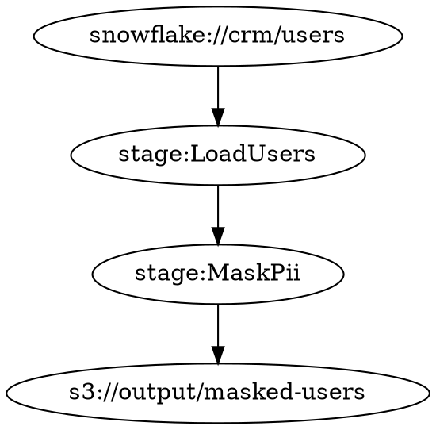

# Roadmap v76.1.0 〜 v77.0.0 — Data Provenance 1.0

Date: 2026-08-14
Status: 未着手（v76.0.0 完了後に開始）

マスターロードマップ: [roadmap-v75.1-v80.0.md](roadmap-v75.1-v80.0.md)

---

## 前提

- 直前完了: v76.0.0「Temporal Data Native 宣言」（tests = 3714）
- 本スプリントは Phase 6「Favnir 3.0 宣言」の第 2 スプリント
- 目標: v77.0.0「Data Provenance 1.0 宣言」（tests = 3736）

### スプリントの性格

「どこから来たデータかを型が保証し、GDPR はコンパイル時に通る」。
`TracedData<T>` 型でデータの来歴を値として持ち回り、OpenLineage と Data Product により
データメッシュアーキテクチャの型基盤を整える。
A（新言語機能）50% + B（エコシステム統合）50% の構成。

---

## バージョン一覧

| バージョン | 内容 | テスト数 | 状態 |
|---|---|---|---|
| v76.1.0 | `DataSource` / `ProvenanceTag` 型基盤 | 3714 + 2 = 3716 | 未着手 |
| v76.2.0 | `TracedData` 型 | 3716 + 2 = 3718 | 未着手 |
| v76.3.0 | PII 来歴追跡・GDPR 消去計画 | 3718 + 2 = 3720 | 未着手 |
| v76.4.0 | OpenLineage 統合強化 | 3720 + 2 = 3722 | 未着手 |
| v76.5.0 | `fav lineage graph` 可視化 | 3722 + 2 = 3724 | 未着手 |
| v76.6.0 | Cross-pipeline provenance | 3724 + 2 = 3726 | 未着手 |
| v76.7.0 | Data product 型 | 3726 + 2 = 3728 | 未着手 |
| v76.8.0 | Provenance contracts | 3728 + 2 = 3730 | 未着手 |
| v76.9.0 | 安定化・コードフリーズ | 3730 + 2 = 3732 | 未着手 |
| v77.0.0 | Data Provenance 1.0 宣言 ★クリーンアップ | 3732 + 4 = 3736 | 未着手 |

---

## v76.1.0 — `DataSource` / `ProvenanceTag` 型基盤

データの出所を型として表現する基盤。「このデータはどのシステムから来たか」を値として持つ。

```favnir
bind source <- DataSource {
    name: "snowflake-crm",
    uri: "snowflake://warehouse/crm/users",
    source_type: Snowflake
}
bind tag <- ProvenanceTag {
    source: source,
    transforms: ["mask_pii", "normalize_email"],
    pii: false
}
```

**実装内容:**
- `DataSourceType` enum（Snowflake, S3, Api, Manual, Pipeline）
- `DataSource` 構造体（name: String, uri: String, source_type: DataSourceType）
- `ProvenanceTag` 構造体（source: DataSource, transforms: Vec<String>, pii: bool）
- `format_provenance_tag(tag: &ProvenanceTag) -> String`

**完了条件**: Rust テスト 2 件（3714 + 2 = 3716）
- `provenance_tag_created`
- `provenance_pii_flagged`

---

## v76.2.0 — `TracedData` 型

データに来歴を付けて持ち回る型。変換を経ても来歴が追跡できる。

```favnir
bind raw    <- TracedData.wrap(rows, source)
bind masked <- raw |> TracedData.map(mask_pii, label: "mask_pii")
// → masked.provenance.transforms = ["mask_pii"]
// → masked.provenance.pii = false（マスク後）
```

**実装内容:**
- `TracedData` 構造体（data: String, provenance: ProvenanceTag）
- `map_traced(t: &TracedData, transform_label: &str) -> TracedData`
  — transform_label を provenance.transforms に追記したコピーを返す
- `merge_provenance(a: &ProvenanceTag, b: &ProvenanceTag) -> ProvenanceTag`
  — join 時の来歴マージ（pii は OR で伝播）

**完了条件**: Rust テスト 2 件（3716 + 2 = 3718）
- `traced_map_appends_transform`
- `traced_merge_propagates_pii`

---

## v76.3.0 — PII 来歴追跡・GDPR 消去計画

PII を含むデータの流れを追跡し、GDPR「忘れられる権利」への対応計画を自動生成する。

```bash
$ fav lineage pii-report pipeline.fav
PII Fields Detected:
  Stage LoadUsers: pii=true  source=snowflake://crm/users
  Stage MaskPii:   pii=false (masked)
  Stage Export:    pii=false — safe

GDPR Erasure Plan:
  target: snowflake://crm/users  action: delete fields=[email, phone]
```

**実装内容:**
- `PiiProvenanceReport` 構造体（source_uri: String, masked: bool）
- `detect_pii_in_tag(tag: &ProvenanceTag) -> bool`
- `ErasurePlan` 構造体（target_uri: String, fields: Vec<String>, reason: String）
- `generate_erasure_plan(tag: &ProvenanceTag) -> Option<ErasurePlan>`
  — pii=true かつ source.uri が存在する場合のみ Some を返す

**完了条件**: Rust テスト 2 件（3718 + 2 = 3720）
- `pii_detected_in_provenance`
- `gdpr_erasure_plan_generated`

---

## v76.4.0 — OpenLineage 統合強化

`ProvenanceTag` を OpenLineage ファセットに変換し、標準的なリネージ追跡ツールと統合する。

```favnir
bind facet <- OpenLineage.from_provenance(tag)
// → {
//     "_producer": "favnir/v76",
//     "dataSource": { "uri": "snowflake://crm/users" },
//     "columnLineage": { "transforms": ["mask_pii"] }
//   }
```

**実装内容:**
- `OpenLineageFacet` 構造体（producer: String, data_source_uri: String, transforms: Vec<String>）
- `provenance_to_openlineage(tag: &ProvenanceTag) -> OpenLineageFacet`
- `format_openlineage_json(facet: &OpenLineageFacet) -> String` — JSON 文字列生成

**完了条件**: Rust テスト 2 件（3720 + 2 = 3722）
- `openlineage_facet_from_provenance`
- `openlineage_json_format`

---

## v76.5.0 — `fav lineage graph` 可視化

パイプラインのリネージグラフを Graphviz DOT 形式で出力。視覚的なデータフロー確認を実現する。

```bash
$ fav lineage graph pipeline.fav --format dot > lineage.dot
$ dot -Tpng lineage.dot -o lineage.png
```



**実装内容:**
- `LineageNodeType` enum（Source, Transform, Sink）
- `LineageNode` 構造体（id: String, node_type: LineageNodeType, label: String）
- `LineageEdge` 構造体（from: String, to: String）
- `LineageGraph` 構造体（nodes: Vec<LineageNode>, edges: Vec<LineageEdge>）
- `format_lineage_dot(graph: &LineageGraph) -> String`

**完了条件**: Rust テスト 2 件（3722 + 2 = 3724）
- `lineage_graph_built`
- `lineage_dot_format`

---

## v76.6.0 — Cross-pipeline provenance

複数のパイプラインを跨いだ来歴の連鎖を表現する。上流パイプラインの来歴を下流に引き継ぐ。

```favnir
// パイプライン A の出力来歴を B に引き継ぐ
bind chain <- chain_provenance(pipeline_a_tag, "ml-pipeline-b")
// → chain.transforms = [...pipeline_a_transforms, "ml-pipeline-b"]
// → chain.pii は上流の pii を引き継ぐ（true があれば true）
```

**実装内容:**
- `PipelineProvenanceChain` 構造体（pipelines: Vec<String>, merged_tag: ProvenanceTag）
- `chain_provenance(upstream: &ProvenanceTag, pipeline_name: &str) -> ProvenanceTag`
  — upstream を親として新しい ProvenanceTag を生成（transforms に pipeline_name を追加）
- `format_chain_report(chain: &PipelineProvenanceChain) -> String`

**完了条件**: Rust テスト 2 件（3724 + 2 = 3726）
- `cross_pipeline_provenance_chained`
- `cross_pipeline_pii_propagated`

---

## v76.7.0 — Data product 型

データ製品（Data Product）をファーストクラス型として表現。データメッシュアーキテクチャの基盤。

```favnir
bind product <- DataProduct {
    name: "customer-360",
    owner: "data-platform-team",
    sla: DataProductSla { freshness_minutes: 60 },
    provenance_policy: ProvenancePolicy {
        require_source_declared: true,
        pii_must_be_masked: true
    }
}
bind _ <- DataProduct.validate(product, tag)
```

**実装内容:**
- `DataProductSla` 構造体（freshness_minutes: u64）
- `ProvenancePolicy` 構造体（require_source_declared: bool, pii_must_be_masked: bool）
- `DataProduct` 構造体（name: String, owner: String, sla: DataProductSla, provenance_policy: ProvenancePolicy）
- `validate_data_product(product: &DataProduct, tag: &ProvenanceTag) -> Result<(), String>`

**完了条件**: Rust テスト 2 件（3726 + 2 = 3728）
- `data_product_validated`
- `data_product_pii_policy_violated`

---

## v76.8.0 — Provenance contracts

コントラクトに来歴ポリシーを組み込む。「このパイプラインの入力は必ず Snowflake から来ること」を型で保証する。

```favnir
contract ExportPipeline {
    input:      { rows: List<Row> }
    output:     { exported: Bool }
    provenance: ProvenanceContract {
        allowed_sources: [Snowflake, S3],
        pii_policy: MustBeMasked
    }
}
```

**実装内容:**
- `PiiPolicy` enum（MustBeMasked, AllowRaw, MustBeAbsent）
- `ProvenanceContract` 構造体（allowed_sources: Vec<DataSourceType>, pii_policy: PiiPolicy）
- `validate_provenance_contract(contract: &ProvenanceContract, tag: &ProvenanceTag) -> Result<(), String>`

**完了条件**: Rust テスト 2 件（3728 + 2 = 3730）
- `provenance_contract_source_violation`
- `provenance_contract_pii_violation`

---

## v76.9.0 — 安定化・コードフリーズ（Data Provenance 前最終調整）

v76.1〜v76.8 の全機能を通しで確認する最終安定化スプリント。

**実装内容:**
- v76.1〜v76.8 の全テスト通過確認（`cargo test` 全 pass）
- `TracedData` / `OpenLineageFacet` / `DataProduct` の E2E 動作確認
- バグ修正のみ受け入れ（新機能追加なし）

**完了条件**: Rust テスト 2 件（3730 + 2 = 3732）
- `provenance_full_sprint_all_stable`
- `provenance_e2e_pipeline_valid`

---

## v77.0.0 — Data Provenance 1.0 宣言 ★クリーンアップ

**宣言文**:
> 「データの来歴が型となった。どこから来て、何を経て、PII がどこで消えたかを
>  Favnir が型で追跡する。GDPR はコンパイル時に通る。」

**クリーンアップ作業:**
- `cargo clean` 実施
- `Cargo.toml` バージョンを `77.0.0` に更新
- `CHANGELOG.md` に v77.0.0 エントリを追加
- `MILESTONE.md` に「Data Provenance 1.0」を追記
- `README.md` に v77.0 達成を追記
- `versions/current.md` を更新

**完了条件**: `v77000_tests` 4 件（3732 + 4 = 3736）
- `cargo_toml_version_is_77_0_0`
- `changelog_has_v77_0_0`
- `milestone_has_data_provenance`
- `readme_mentions_provenance`

---

## テスト数推移（本スプリント）

| バージョン | テスト数 | 増加 |
|---|---|---|
| v76.0.0（ベース） | 3,714 | — |
| v76.1.0 | 3,716 | +2 |
| v76.2.0 | 3,718 | +2 |
| v76.3.0 | 3,720 | +2 |
| v76.4.0 | 3,722 | +2 |
| v76.5.0 | 3,724 | +2 |
| v76.6.0 | 3,726 | +2 |
| v76.7.0 | 3,728 | +2 |
| v76.8.0 | 3,730 | +2 |
| v76.9.0 | 3,732 | +2 |
| v77.0.0（宣言） | 3,736 | +4 |

**本スプリント合計**: +22 tests（3,714 → 3,736）

---

## 参考リンク

- マスターロードマップ: [roadmap-v75.1-v80.0.md](roadmap-v75.1-v80.0.md)
- 前スプリント: [roadmap-v75.1-v76.0.md](roadmap-v75.1-v76.0.md)
- 次スプリント: [roadmap-v77.1-v78.0.md](roadmap-v77.1-v78.0.md)
- 達成宣言: `MILESTONE.md`
- 進行状況: `versions/current.md`
