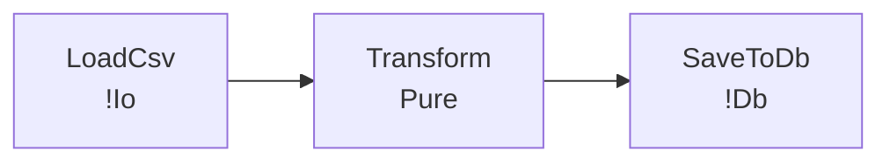

# v21.2.0 実装計画 — fav explain 可視化強化（Mermaid / D2）

## 実装順序

```
T1（lineage.rs — render_lineage_mermaid / render_lineage_d2）  ← 最初（T6 テストが依存）
T2（driver.rs — cmd_explain_lineage 更新）                     ← T1 完了後
T3（main.rs — CLI 引数パース更新）                             ← T2 完了後
T4（Cargo.toml バージョン更新）                                ← T1 と並列可
T5（CHANGELOG + lineage.mdx）                                  ← T3 完了後
T6（driver.rs — v212000_tests）                                ← T1 完了後
```

**Rust コードへの変更は T1〜T2 と T6。**
T3 は文字列処理のみ（新型なし）。

---

## T1: `fav/src/lineage.rs` — Mermaid / D2 レンダラー追加

### 1-1. `render_lineage_mermaid`

`LineageReport` から Mermaid `flowchart LR` テキストを生成する。

```rust
/// LineageReport を Mermaid flowchart LR 形式にレンダリングする。
pub fn render_lineage_mermaid(report: &LineageReport) -> String {
    let mut out = String::from("flowchart LR\n");

    // ノード定義: stage / fn ごとに1ノード
    for entry in &report.transformations {
        let effects = if entry.effects.is_empty() {
            "Pure".to_string()
        } else {
            entry.effects.iter()
                .map(|e| format!("!{}", e.trim_start_matches('!')))
                .collect::<Vec<_>>()
                .join("+")
        };
        // ノード ID は英数字のみ（スペース除去）
        let id = sanitize_mermaid_id(&entry.name);
        out.push_str(&format!("  {}[\"{}\n{}\"]\n", id, entry.name, effects));
    }

    // エッジ定義: pipeline の steps を順に接続
    for pipeline in &report.pipelines {
        let steps = &pipeline.steps;
        for i in 0..steps.len().saturating_sub(1) {
            let from = sanitize_mermaid_id(&steps[i]);
            let to   = sanitize_mermaid_id(&steps[i + 1]);
            out.push_str(&format!("  {} --> {}\n", from, to));
        }
    }

    out
}

/// Mermaid ノード ID として使える文字列に変換する（英数字 + アンダースコアのみ）。
fn sanitize_mermaid_id(name: &str) -> String {
    name.chars()
        .map(|c| if c.is_alphanumeric() || c == '_' { c } else { '_' })
        .collect()
}
```

### 1-2. `render_lineage_d2`

`LineageReport` から D2 diagram テキストを生成する。

```rust
/// LineageReport を D2 diagram 形式にレンダリングする。
pub fn render_lineage_d2(report: &LineageReport) -> String {
    let mut out = String::new();

    // ノード定義
    for entry in &report.transformations {
        let effects = if entry.effects.is_empty() {
            "Pure".to_string()
        } else {
            entry.effects.iter()
                .map(|e| format!("!{}", e.trim_start_matches('!')))
                .collect::<Vec<_>>()
                .join(", ")
        };
        let id = sanitize_mermaid_id(&entry.name);
        out.push_str(&format!("{}: \"{} ({})\"\n", id, entry.name, effects));
    }

    // エッジ定義
    for pipeline in &report.pipelines {
        let steps = &pipeline.steps;
        for i in 0..steps.len().saturating_sub(1) {
            let from = sanitize_mermaid_id(&steps[i]);
            let to   = sanitize_mermaid_id(&steps[i + 1]);
            out.push_str(&format!("{} -> {}\n", from, to));
        }
    }

    out
}
```

### 事前確認コマンド

```bash
# 既存の pub 関数を確認
grep -n "^pub fn render_lineage" fav/src/lineage.rs
# → render_lineage_text / render_lineage_json が既存

# lineage.rs の pub use 確認
grep -n "render_lineage" fav/src/driver.rs | head -5
# → pub use crate::lineage::{..., render_lineage_json, render_lineage_text, ...}
```

---

## T2: `fav/src/driver.rs` — `cmd_explain_lineage` 更新

### 2-1. `pub use` に新関数を追加

既存の `pub use crate::lineage::{...}` ブロックを **丸ごと置き換える**（追記すると重複エラーになる）。

```rust
pub use crate::lineage::{
    extract_tables_from_sql, lineage_analysis,
    render_lineage_json, render_lineage_text,
    render_lineage_mermaid, render_lineage_d2,  // ← 追加
};
```

### 2-2. `cmd_explain_lineage` の format 分岐を拡張

現状:
```rust
if format == "json" {
    print!("{}", render_lineage_json(&report));
} else {
    print!("{}", render_lineage_text(&report, path));
}
```

変更後:
```rust
match format {
    "json"    => print!("{}", render_lineage_json(&report)),
    "mermaid" => print!("{}", render_lineage_mermaid(&report)),
    "d2"      => print!("{}", render_lineage_d2(&report)),
    _         => print!("{}", render_lineage_text(&report, path)),  // "text" がデフォルト
}
```

---

## T3: `fav/src/main.rs` — CLI 引数パース更新

### 事前確認

```bash
grep -n "\"--lineage\"\|\"--format\"\|explain_lineage\|cmd_explain_lineage" fav/src/main.rs | head -10
```

### 変更内容

`fav explain --lineage` のパース箇所で `--format` の受け付け値に `"mermaid"` / `"d2"` を追加する。
（既存の `"text"` / `"json"` に追記するだけ — パースロジック自体は変更不要）

docstring / ヘルプテキストのみ更新:
```
--format text|json|mermaid|d2   (default: text)
```

---

## T4: `fav/Cargo.toml` バージョン更新

`version = "21.1.0"` → `"21.2.0"`

`v211000_tests::version_is_21_1_0` に `#[ignore]` を追加
（`fav/src/driver.rs` の `v211000_tests` モジュール内）

---

## T5: `CHANGELOG.md` + `site/content/docs/tools/lineage.mdx`

### CHANGELOG エントリ

```markdown
## [v21.2.0] — 2026-06-20 — fav explain 可視化強化

### Added
- `fav explain --lineage --format mermaid` — Mermaid `flowchart LR` 形式でパイプライングラフを出力
- `fav explain --lineage --format d2` — D2 diagram 形式でパイプライングラフを出力
- `render_lineage_mermaid` / `render_lineage_d2` を `lineage.rs` に追加
- `site/content/docs/tools/lineage.mdx` — 可視化出力の使い方ドキュメント
```

### site/content/docs/tools/lineage.mdx の骨格

```mdx
# fav explain --lineage

パイプラインの依存グラフを可視化する。

## 出力形式

```bash
fav explain --lineage --format mermaid src/pipeline.fav
fav explain --lineage --format d2 src/pipeline.fav
fav explain --lineage --format json src/pipeline.fav
fav explain --lineage src/pipeline.fav  # default: text
```

## Mermaid 出力例



## D2 出力例

```d2
LoadCsv: "LoadCsv (!Io)"
Transform: "Transform (Pure)"
SaveToDb: "SaveToDb (!Db)"
LoadCsv -> Transform
Transform -> SaveToDb
```
```

---

## T6: `fav/src/driver.rs` — `v212000_tests` 追加

```rust
// ── v212000_tests (v21.2.0) — fav explain 可視化強化 ─────────────────────────
#[cfg(test)]
#[cfg(not(target_arch = "wasm32"))]
mod v212000_tests {
    #[test]
    fn version_is_21_2_0() {
        let cargo = include_str!("../Cargo.toml");
        assert!(cargo.contains("21.2.0"), "Cargo.toml should have version 21.2.0");
    }

    #[test]
    fn render_lineage_mermaid_basic() {
        use crate::lineage::{LineageEntry, LineageReport, PipelineLineage, render_lineage_mermaid};
        let report = LineageReport {
            transformations: vec![
                LineageEntry {
                    name: "LoadCsv".to_string(),
                    kind: "stage".to_string(),
                    capability: None,
                    effects: vec!["!Io".to_string()],
                    sources: vec![],
                    sinks: vec![],
                },
                LineageEntry {
                    name: "Transform".to_string(),
                    kind: "stage".to_string(),
                    capability: None,
                    effects: vec![],
                    sources: vec![],
                    sinks: vec![],
                },
            ],
            pipelines: vec![],
        };
        let mermaid = render_lineage_mermaid(&report);
        assert!(mermaid.contains("flowchart LR"), "should have flowchart header");
        assert!(mermaid.contains("LoadCsv"), "should have LoadCsv node");
        assert!(mermaid.contains("Transform"), "should have Transform node");
    }

    #[test]
    fn render_lineage_mermaid_pipeline_edges() {
        use crate::lineage::{LineageReport, PipelineLineage, render_lineage_mermaid};
        let report = LineageReport {
            transformations: vec![],
            pipelines: vec![PipelineLineage {
                name: "main".to_string(),
                steps: vec!["LoadCsv".to_string(), "Transform".to_string(), "SaveToDb".to_string()],
                sources: vec![],
                sinks: vec![],
            }],
        };
        let mermaid = render_lineage_mermaid(&report);
        assert!(mermaid.contains("-->"), "should have edge arrows");
        assert!(mermaid.contains("LoadCsv"), "should contain LoadCsv");
        assert!(mermaid.contains("SaveToDb"), "should contain SaveToDb");
    }

    #[test]
    fn render_lineage_d2_basic() {
        use crate::lineage::{LineageEntry, LineageReport, PipelineLineage, render_lineage_d2};
        let report = LineageReport {
            transformations: vec![
                LineageEntry {
                    name: "LoadCsv".to_string(),
                    kind: "stage".to_string(),
                    capability: None,
                    effects: vec!["!Io".to_string()],
                    sources: vec![],
                    sinks: vec![],
                },
            ],
            pipelines: vec![PipelineLineage {
                name: "main".to_string(),
                steps: vec!["LoadCsv".to_string(), "Transform".to_string()],
                sources: vec![],
                sinks: vec![],
            }],
        };
        let d2 = render_lineage_d2(&report);
        assert!(d2.contains("LoadCsv"), "should have LoadCsv node");
        assert!(d2.contains("->"), "should have edge arrow");
    }

    #[test]
    fn lineage_format_mermaid_no_panic() {
        use crate::lineage::{lineage_analysis, render_lineage_mermaid};
        use crate::frontend::parser::Parser;
        let src = r#"
stage Transform: List<Row> -> List<Row> = |rows| { rows }
seq Pipeline = Transform
"#;
        let program = Parser::parse_str(src, "test.fav").expect("parse ok");
        let report = lineage_analysis(&program);
        let mermaid = render_lineage_mermaid(&report);
        assert!(!mermaid.is_empty(), "mermaid output should not be empty");
        assert!(mermaid.contains("flowchart LR"));
    }
}
```
