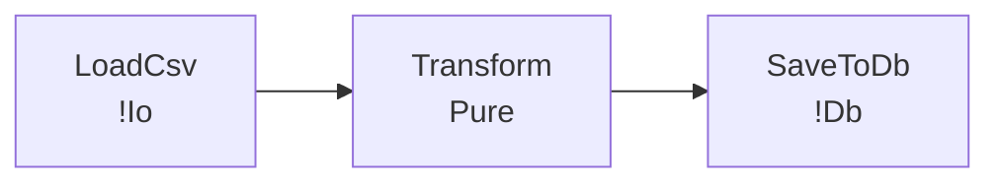

# v21.2.0 Spec — fav explain 可視化強化（Mermaid / D2）

## 概要

`fav explain --lineage` の出力形式を **テキスト / JSON** だけでなく
**Mermaid / D2** にも対応させ、パイプラインの依存グラフを視覚的に確認できるようにする。

**テーマ**: Developer Tooling Complete シリーズ第2弾 — 「図を見てパイプラインを把握できる」

---

## 動機

v7.1.0 で実装した `fav explain --lineage` はテキスト出力のみ。
大きなパイプライン（10 stage 超）では、依存関係を頭の中で把握するのが困難。

Mermaid は GitHub / Notion / Obsidian でそのままレンダリングされるため、
README や設計ドキュメントへの貼り付けが即座にできる。

---

## 成果物一覧

| 成果物 | 役割 |
|---|---|
| `fav/src/lineage.rs` | `render_lineage_mermaid` / `render_lineage_d2` 追加 |
| `fav/src/driver.rs` | `cmd_explain_lineage` に `mermaid` / `d2` 形式対応 |
| `fav/src/main.rs` | `fav explain --lineage --format` の引数パース更新 |
| `site/content/docs/tools/lineage.mdx` | 可視化出力の使い方（Mermaid / D2 例含む）|

---

## 機能仕様

### サポートする出力形式

| `--format` 値 | 出力 | 用途 |
|---|---|---|
| `text`（デフォルト） | テキスト（既存） | ターミナル確認 |
| `json` | JSON（既存） | CI / 外部ツール連携 |
| `mermaid` | Mermaid `flowchart LR` | GitHub / Notion / Obsidian |
| `d2` | D2 diagram | インタラクティブ SVG |

### CLI

```bash
# Mermaid 形式（stdout）
fav explain --lineage --format mermaid src/pipeline.fav

# D2 形式（stdout）
fav explain --lineage --format d2 src/pipeline.fav

# ファイルに出力（リダイレクト）
fav explain --lineage --format mermaid src/pipeline.fav > pipeline.mmd
```

---

## Mermaid 出力仕様



### ノード生成ルール

- 各 `stage` / `fn` を1ノードとして生成
- ノードラベル: `"<name>\n<effects>"` 形式
- エフェクトなし → `"Pure"`
- エフェクトあり → `"!Io"` / `"!Db"` 等（複数は `+` 区切り）

### エッジ生成ルール

- `seq` / `|>` パイプラインの各ステップを順にエッジで接続
- `par [A, B]` の分岐エッジ対応は将来版（v21.3.0 以降）への持ち越し

### エフェクト文字列形式

- `entry.effects` は `lineage_analysis` が `"!Io"` / `"!Db"` 形式の文字列リストを返す
- Mermaid ノードラベル: `!Io+!Db`（`+` 区切り）
- D2 ノードラベル: `!Io, !Db`（`, ` 区切り）
- エフェクトなし: `"Pure"`

---

## D2 出力仕様

```d2
LoadCsv: "LoadCsv (!Io)"
Transform: "Transform (Pure)"
SaveToDb: "SaveToDb (!Db)"
LoadCsv -> Transform
Transform -> SaveToDb
```

---

## テスト（v212000_tests、5件）

| テスト名 | 内容 |
|---|---|
| `version_is_21_2_0` | Cargo.toml に `"21.2.0"` が含まれる |
| `render_lineage_mermaid_basic` | 単純な pipeline → Mermaid に `flowchart LR` とノード名が含まれる |
| `render_lineage_mermaid_pipeline_edges` | seq pipeline → Mermaid に `-->` エッジが含まれる |
| `render_lineage_d2_basic` | 単純な pipeline → D2 にノード名と `->` が含まれる |
| `lineage_format_mermaid_no_panic` | `cmd_explain_lineage` 相当の処理が mermaid 形式でパニックしない |

---

## 完了条件

- [ ] `fav explain --lineage --format mermaid <file>` が Mermaid テキストを stdout に出力する
- [ ] `fav explain --lineage --format d2 <file>` が D2 テキストを stdout に出力する
- [ ] `fav explain --lineage --format text` / `json` の既存動作がリグレッションしない
- [ ] Mermaid 出力に `flowchart LR` ヘッダー、ノード定義、エッジが含まれる
- [ ] D2 出力にノード定義と `->` エッジが含まれる
- [ ] `site/content/docs/tools/lineage.mdx` が存在する
- [ ] `cargo test v212000` — 5/5 PASS
- [ ] `cargo test` — リグレッションなし
- [ ] `CHANGELOG.md` に v21.2.0 エントリが追加されている
- [ ] `fav/Cargo.toml` version が `21.2.0`
