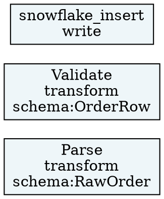

# Spec: v52.3.0 — `fav explain --lineage` 表示強化（スキーマ情報付加）

Status: PLANNED
Date: 2026-07-21

---

## 目的

v52.1.0 / v52.2.0 で `assert_schema<T>(value)` の型チェック・nullable・strict モードを実装した。
v52.3.0 では既存の `fav explain --lineage` コマンドに `--with-schema` オプションを追加し、
各ステージが `assert_schema<T>` で検証したスキーマ名をノードラベルに表示する。

**実装スコープ（既存機能の拡張）**:
- `fav explain --lineage --format mermaid --with-schema` — Mermaid ノードラベルにスキーマ名追加
- `fav explain --lineage --format dot --with-schema` — DOT ノードラベルにスキーマ名追加
- `lineage_analysis` で `Expr::AssertSchema { ty_name, .. }` を検出してスキーマ名を収集
- `LineageEntry` に `pub schema: Option<String>` フィールドを追加

**対象外（別バージョン）**:
- `--format html`（v52.4.0 で実装）
- SLA 監視（v52.5.0 で実装）

---

## 出力イメージ

```bash
$ fav explain --lineage pipeline.fav --format mermaid --with-schema
```

```
flowchart LR
  Parse["Parse<br/>Pure<br/>schema:RawOrder"] --> Validate["Validate<br/>Pure<br/>schema:OrderRow"]
  Validate --> snowflake_insert["snowflake_insert<br/>Pure"]
```

```bash
$ fav explain --lineage pipeline.fav --format dot --with-schema
```



スキーマ名がない（`assert_schema` を使用していない）ステージは従来と同じ表示のまま。

---

## 変更ファイル一覧

| ファイル | 変更内容 |
|---|---|
| `fav/src/lineage.rs` | `LineageEntry` に `pub schema: Option<String>` 追加、`collect_assert_schema_name` 関数追加、`lineage_analysis` でスキーマ収集、`render_lineage_mermaid_with_schema` 追加、`render_lineage_dot_with_schema` 追加 |
| `fav/src/driver.rs` | `cmd_explain_lineage` に `with_schema: bool` 引数追加、mermaid/dot 呼び出しを `*_with_schema` 版に切り替え、`v52300_tests` モジュール追加（2 件） |
| `fav/src/main.rs` | `--with-schema` CLI フラグ解析、`cmd_explain_lineage` 呼び出しに `with_schema` 追加 |
| `fav/Cargo.toml` | version → `"52.3.0"` |
| `CHANGELOG.md` | v52.3.0 エントリ追加 |
| `versions/current.md` | v52.3.0（3140 tests）に更新 |
| `versions/roadmap/roadmap-v52.1-v53.0.md` | v52.3.0 実績欄を更新 |

---

## 詳細仕様

### 1. `LineageEntry.schema` 追加（lineage.rs）

```rust
#[derive(Debug, Clone, Serialize)]
pub struct LineageEntry {
    pub name: String,
    pub kind: String,
    pub capability: Option<String>,
    pub effects: Vec<String>,
    pub sources: Vec<String>,
    pub sinks: Vec<String>,
    pub is_dead: bool,
    pub schema: Option<String>,  // v52.3.0: first assert_schema<T> type name in body
}
```

`#[serde(skip_serializing_if = "Option::is_none")]` は付与しない（JSON 出力の一貫性のため `null` を出力）。

既存の `LineageEntry` 構築箇所すべてに `schema: None` を追加する（コンパイルエラーで洗い出し）。

### 2. `collect_assert_schema_name` 関数（lineage.rs）

`Expr::AssertSchema { ty_name, .. }` を再帰的に検出し、最初に見つかった `ty_name` を返す。

```rust
/// Collect the first `assert_schema<T>` type name from an expression tree.
pub fn collect_assert_schema_name(expr: &ast::Expr) -> Option<String> {
    match expr {
        ast::Expr::AssertSchema { ty_name, .. } => Some(ty_name.clone()),
        ast::Expr::Block(block) => {
            for s in &block.stmts {
                if let Some(name) = collect_assert_schema_name_stmt(s) {
                    return Some(name);
                }
            }
            collect_assert_schema_name(&block.expr)
        }
        ast::Expr::Pipeline(exprs, _) => {
            exprs.iter().find_map(collect_assert_schema_name)
        }
        ast::Expr::Apply(func, args, _) => {
            collect_assert_schema_name(func)
                .or_else(|| args.iter().find_map(collect_assert_schema_name))
        }
        ast::Expr::If(cond, then_blk, else_blk, _) => {
            collect_assert_schema_name(cond)
                .or_else(|| collect_assert_schema_name_block(then_blk))
                .or_else(|| else_blk.as_ref().and_then(|b| collect_assert_schema_name_block(b)))
        }
        ast::Expr::Match(scrutinee, arms, _) => {
            collect_assert_schema_name(scrutinee)
                .or_else(|| arms.iter().find_map(|a| collect_assert_schema_name(&a.body)))
        }
        _ => None,
    }
}

fn collect_assert_schema_name_stmt(s: &ast::Stmt) -> Option<String> {
    match s {
        ast::Stmt::Bind(_, expr, _) => collect_assert_schema_name(expr),
        ast::Stmt::Return(expr) => collect_assert_schema_name(expr),
        ast::Stmt::Emit(expr) => collect_assert_schema_name(expr),
        _ => None,
    }
}

fn collect_assert_schema_name_block(b: &ast::Block) -> Option<String> {
    for s in &b.stmts {
        if let Some(name) = collect_assert_schema_name_stmt(s) {
            return Some(name);
        }
    }
    collect_assert_schema_name(&b.expr)
}
```

### 3. `lineage_analysis` 更新（lineage.rs）

各 TrfDef の `LineageEntry` 構築時にスキーマ名を収集する。

```rust
let schema = collect_assert_schema_name_block(&trf.body);
// ...
transformations.push(LineageEntry {
    name: trf.name.clone(),
    kind: cap_kind,
    capability: cap_name,
    effects,
    sources,
    sinks,
    is_dead,
    schema,  // v52.3.0
});
```

fn ブロック（`ast::Item::FnDef`）の `LineageEntry` 構築箇所にも `schema: None` を追加する
（fn は `assert_schema` を使わない前提のため収集しない）。

### 4. `render_lineage_mermaid_with_schema` 追加（lineage.rs）

既存の `render_lineage_mermaid_with_opts(report, show_dead)` は変更せず、
`with_schema` を追加した新関数を追加する（後方互換維持）。

```rust
/// v52.3.0: `--with-schema` オプション付き mermaid レンダリング。
/// `with_schema = true` のとき、スキーマ名が存在するノードラベルに `\nschema:<Name>` を追加。
pub fn render_lineage_mermaid_with_schema(
    report: &LineageReport,
    show_dead: bool,
    with_schema: bool,
) -> String {
    let mut out = String::from("flowchart LR\n");
    if show_dead && report.transformations.iter().any(|e| e.is_dead) {
        out.push_str("    classDef deadEntry stroke-dasharray:5 5\n");
    }

    for entry in &report.transformations {
        let effects = if entry.effects.is_empty() {
            "Pure".to_string()
        } else {
            entry.effects.iter()
                .map(|e| format!("!{}", e.trim_start_matches('!')))
                .collect::<Vec<_>>()
                .join("+")
        };
        let id = sanitize_mermaid_id(&entry.name);
        let schema_label = if with_schema {
            entry.schema.as_ref()
                .map(|s| format!("<br/>schema:{}", s))
                .unwrap_or_default()
        } else {
            String::new()
        };
        out.push_str(&format!(
            "  {}[\"{}<br/>{}{}\"]\n",
            id, entry.name, effects, schema_label
        ));
        if show_dead && entry.is_dead {
            out.push_str(&format!("  class {} deadEntry\n", id));
        }
    }

    for pipeline in &report.pipelines {
        let steps = &pipeline.steps;
        for i in 0..steps.len().saturating_sub(1) {
            let from = sanitize_mermaid_id(&steps[i]);
            let to   = sanitize_mermaid_id(&steps[i + 1]);
            out.push_str(&format!("  {} --> {}\n", from, to));
        }
    }

    out
}
```

### 5. `render_lineage_dot_with_schema` 追加（lineage.rs）

既存の `render_lineage_dot(report)` は変更せず、`with_schema` 付き版を追加する。

```rust
/// v52.3.0: `--with-schema` オプション付き DOT レンダリング。
pub fn render_lineage_dot_with_schema(report: &LineageReport, with_schema: bool) -> String {
    let mut out = String::from(
        "digraph lineage {\n    rankdir=LR;\n    node [shape=box style=filled fillcolor=\"#eef6f9\"];\n"
    );

    for entry in &report.transformations {
        let id = sanitize_mermaid_id(&entry.name);
        let schema_part = if with_schema {
            entry.schema.as_ref()
                .map(|s| format!("\\nschema:{}", s))
                .unwrap_or_default()
        } else {
            String::new()
        };
        let label = format!("{}\\n{}{}", entry.name, entry.kind, schema_part);
        out.push_str(&format!("    {} [label=\"{}\"];\n", id, label));
    }

    for pipeline in &report.pipelines {
        let steps = &pipeline.steps;
        for i in 0..steps.len().saturating_sub(1) {
            let from = sanitize_mermaid_id(&steps[i]);
            let to   = sanitize_mermaid_id(&steps[i + 1]);
            out.push_str(&format!("    {} -> {};\n", from, to));
        }
    }

    out.push('}');
    out
}
```

### 6. `cmd_explain_lineage` 更新（driver.rs）

シグネチャに `with_schema: bool` を追加。`mermaid` / `dot` の分岐で `*_with_schema` 版を呼ぶ。

```rust
pub fn cmd_explain_lineage(file: Option<&str>, format: &str, show_dead: bool, with_schema: bool) {
    // ...（既存のファイル収集・パース処理は変更なし）
    match format {
        "json"    => print!("{}", render_lineage_json(&report)),
        "mermaid" => print!("{}", render_lineage_mermaid_with_schema(&report, show_dead, with_schema)),
        "d2"      => print!("{}", render_lineage_d2(&report)),
        "dot"     => print!("{}", render_lineage_dot_with_schema(&report, with_schema)),
        "svg"     => print!("{}", render_lineage_svg(&report)),
        "text"    => print!("{}", render_lineage_text(&report, path)),
        other     => { /* 既存エラー処理 */ }
    }
}
```

### 7. `main.rs` — `--with-schema` フラグ解析

`--lineage` ブロックの `while i < args.len()` ループに `"--with-schema"` アームを追加:

```rust
"--with-schema" => { with_schema = true; i += 1; }
```

`cmd_explain_lineage` 呼び出しに `with_schema` を追加:

```rust
cmd_explain_lineage(file, &format, show_dead, with_schema);
```

---

## テスト（2 件）

追加先: `driver.rs` の `v52300_tests` モジュール（`v52200_tests` の直前）

### `lineage_mermaid_with_schema`

```rust
#[test]
fn lineage_mermaid_with_schema() {
    let src = include_str!("lineage.rs");
    assert!(src.contains("with_schema"), "lineage.rs must implement with_schema rendering");
    assert!(
        src.contains("collect_assert_schema_name"),
        "lineage.rs must have collect_assert_schema_name function"
    );
}
```

### `lineage_dot_with_schema`

```rust
#[test]
fn lineage_dot_with_schema() {
    let src = include_str!("lineage.rs");
    assert!(
        src.contains("pub schema: Option<String>"),
        "LineageEntry must have schema field"
    );
    let main = include_str!("main.rs");
    assert!(
        main.contains("with-schema"),
        "main.rs must support --with-schema flag"
    );
}
```

---

## テスト数

- ベース: **3138** tests（v52.2.0 完了時点）
- `v52200_tests` に version テストなし → 削除 0 件
- 追加: `v52300_tests` 2 件
- **合計: 3140 tests**

（ロードマップ記載の「3141」は 1 件多い推定値 → 実装完了時に roadmap の当該行を 3140 に訂正する）

**テスト設計の判断メモ（技術的負債）**:
現時点のテストは「実装が存在するか」を `include_str!` で確認する方式であり、
`render_lineage_mermaid_with_schema` の実際の出力内容（`schema:XXX` が含まれるか）を検証していない。
将来 v52.9.0 の安定化フェーズで E2E 出力検証テストの追加を検討すること。

---

## 完了条件

- `cargo test` 3140 passed, 0 failed
- `cargo clippy -- -D warnings` クリーン
- `fav explain --lineage <file> --format mermaid --with-schema` でスキーマ名が `schema:XXX` としてノードラベルに表示される
- `fav explain --lineage <file> --format dot --with-schema` でスキーマ名が `\nschema:XXX` としてラベルに表示される
- `assert_schema` を使わないステージは `--with-schema` を指定しても表示が変化しない
- `--with-schema` なし（デフォルト）の動作は既存テストが引き続き全 pass する
