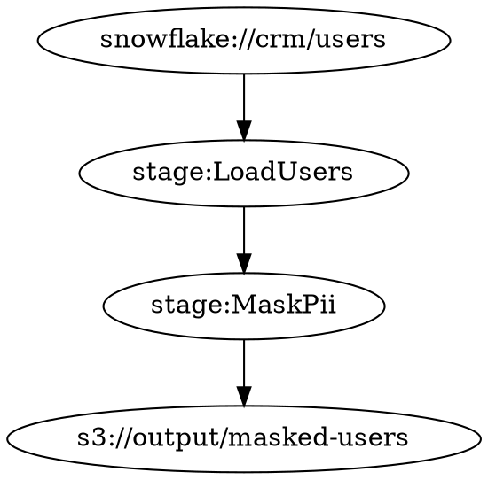

# v76.5.0 仕様書 — `fav lineage graph` 可視化

Date: 2026-08-15
Status: 計画中

---

## Background

パイプラインの来歴情報（`ProvenanceTag`）からリネージグラフを構築し、Graphviz DOT 形式で出力する。データエンジニアがパイプラインのデータフローを視覚的に確認できるようにする。`fav lineage graph pipeline.fav --format dot` で DOT 文字列を生成し、`dot -Tpng` 等で PNG に変換できる。

---

## Goals

1. `LineageNodeType` enum（Source / Transform / Sink）を追加する
2. `LineageNode` 構造体（id: String, node_type: LineageNodeType, label: String）を追加する
3. `LineageEdge` 構造体（from: String, to: String）を追加する
4. `LineageGraph` 構造体（nodes: Vec<LineageNode>, edges: Vec<LineageEdge>）を追加する
5. `format_lineage_dot(graph: &LineageGraph) -> String` を追加する
6. Rust テスト 2 件を追加し 3724 tests に到達する

---

## 型・関数仕様

### `LineageNodeType` enum

```rust
#[derive(Debug, Clone, PartialEq)]
pub enum LineageNodeType {
    Source,
    Transform,
    Sink,
}
```

---

### `LineageNode` 構造体

```rust
#[derive(Debug, Clone)]
pub struct LineageNode {
    pub id:        String,
    pub node_type: LineageNodeType,
    pub label:     String,
}
```

---

### `LineageEdge` 構造体

```rust
#[derive(Debug, Clone)]
pub struct LineageEdge {
    pub from: String,
    pub to:   String,
}
```

---

### `LineageGraph` 構造体

```rust
#[derive(Debug, Clone)]
pub struct LineageGraph {
    pub nodes: Vec<LineageNode>,
    pub edges: Vec<LineageEdge>,
}
```

---

### `format_lineage_dot`

```rust
pub fn format_lineage_dot(graph: &LineageGraph) -> String
```

**出力フォーマット:**



**動作:**
- `digraph lineage {` で始まり `}` で終わる
- 各 `LineageEdge` を `    "<from>" -> "<to>"` の形式で出力する（インデント 4 スペース）
- `LineageEdge.from/to` には **ラベル文字列**（URI・ステージ名等）を格納する。`LineageNode.id` は DOT 出力には使用しない
- `LineageNode` は DOT 出力に直接使用しない（エッジの `from/to` のみ出力）
- ノードが 0 件・エッジが 0 件の場合は `"digraph lineage {\n}"` を返す（`{` と `}` の間に改行 1 個、末尾改行なし）
- 外部ライブラリ不使用（手書き文字列フォーマット）

---

## テスト仕様

### `lineage_graph_built`

```rust
let graph = LineageGraph {
    nodes: vec![
        LineageNode { id: "src1".to_string(),  node_type: LineageNodeType::Source,    label: "snowflake://crm/users".to_string() },
        LineageNode { id: "t1".to_string(),    node_type: LineageNodeType::Transform, label: "stage:LoadUsers".to_string() },
        LineageNode { id: "sink1".to_string(), node_type: LineageNodeType::Sink,      label: "s3://output".to_string() },
    ],
    // from/to にはラベル文字列（URI・ステージ名）を格納する
    edges: vec![
        LineageEdge { from: "snowflake://crm/users".to_string(), to: "stage:LoadUsers".to_string() },
        LineageEdge { from: "stage:LoadUsers".to_string(),       to: "s3://output".to_string() },
    ],
};
assert_eq!(graph.nodes.len(), 3);
assert_eq!(graph.edges.len(), 2);
assert_eq!(graph.nodes[0].node_type, LineageNodeType::Source);
assert_eq!(graph.nodes[1].node_type, LineageNodeType::Transform);
assert_eq!(graph.nodes[2].node_type, LineageNodeType::Sink);
```

### `lineage_dot_format`

```rust
let graph = LineageGraph {
    nodes: vec![
        LineageNode { id: "src".to_string(),  node_type: LineageNodeType::Source, label: "snowflake://crm/users".to_string() },
        LineageNode { id: "t1".to_string(),   node_type: LineageNodeType::Transform, label: "stage:MaskPii".to_string() },
        LineageNode { id: "sink".to_string(), node_type: LineageNodeType::Sink,   label: "s3://output/masked-users".to_string() },
    ],
    edges: vec![
        LineageEdge { from: "snowflake://crm/users".to_string(), to: "stage:MaskPii".to_string() },
        LineageEdge { from: "stage:MaskPii".to_string(),         to: "s3://output/masked-users".to_string() },
    ],
};
let dot = format_lineage_dot(&graph);
assert!(dot.starts_with("digraph lineage {"));
assert!(dot.ends_with("}"));
assert!(dot.contains("\"snowflake://crm/users\" -> \"stage:MaskPii\""));
assert!(dot.contains("\"stage:MaskPii\" -> \"s3://output/masked-users\""));

// 空グラフ
let empty = LineageGraph { nodes: vec![], edges: vec![] };
let empty_dot = format_lineage_dot(&empty);
assert_eq!(empty_dot, "digraph lineage {\n}");
```

---

## Success Criteria

- `LineageNodeType` enum が定義されている（Source / Transform / Sink）
- `LineageNode` / `LineageEdge` / `LineageGraph` 構造体が定義されている
- `format_lineage_dot` が `digraph lineage { ... }` 形式の DOT 文字列を返す
- 空グラフは `"digraph lineage {\n}"` を返す（末尾改行なし）
- `lineage_graph_built` が pass
- `lineage_dot_format` が pass
- `cargo test` が 3724 tests all pass
- `CHANGELOG.md` の先頭に v76.5.0 エントリが存在する

---

## 変更ファイル

- `fav/src/driver.rs` — `LineageNodeType`, `LineageNode`, `LineageEdge`, `LineageGraph`, `format_lineage_dot`, `v765000_tests` を追加
- `CHANGELOG.md` — v76.5.0 エントリを追加
- `versions/current.md` — 進行中バージョンを更新
- `fav/Cargo.toml` — バージョンを `76.4.0` → `76.5.0` に更新

---

## 依存（既実装）

- `ProvenanceTag` 構造体（v76.1.0）— 来歴情報の入力源（本バージョンでは直接利用しないが同スプリントの一部）

---

## 対象外

- `fav lineage graph` CLI コマンドの実際の統合（将来バージョン）
- `pipeline.fav` ファイルを解析して自動でグラフ構築（将来バージョン）
- Graphviz 外部コマンド呼び出し（`dot -Tpng` 等）
- ノードのスタイル指定（色・形・ラベル属性 `[label="..."]` 等）
